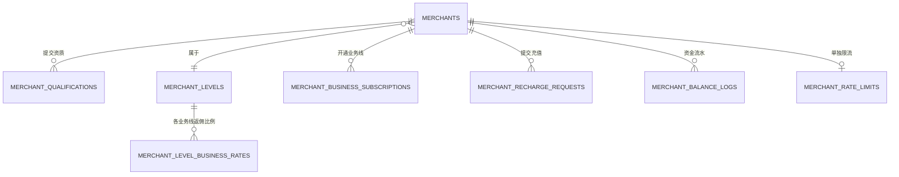
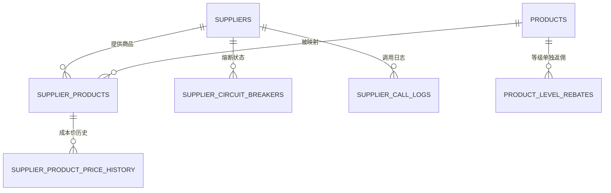
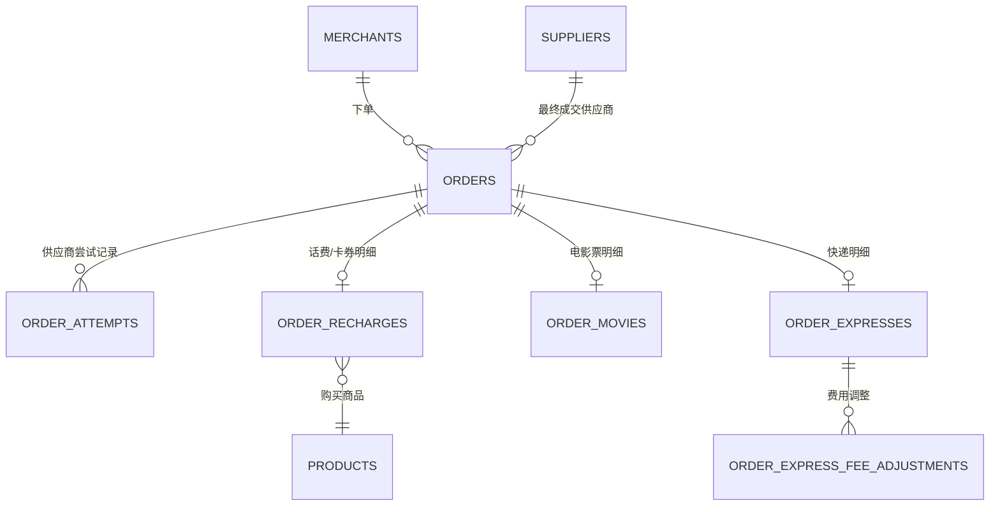
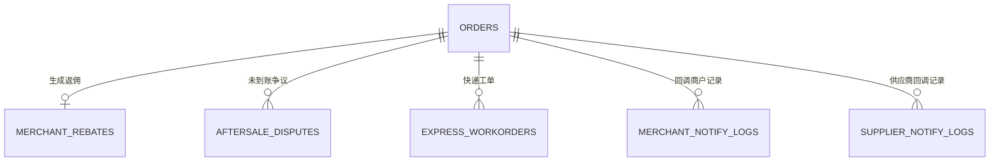
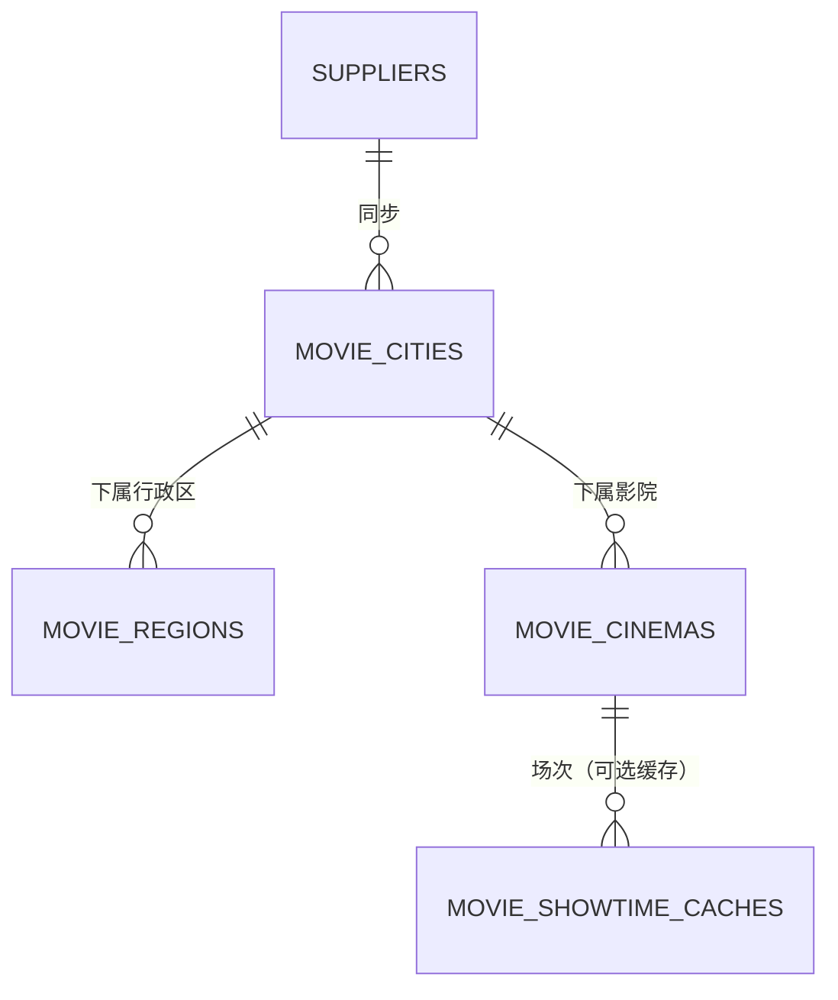
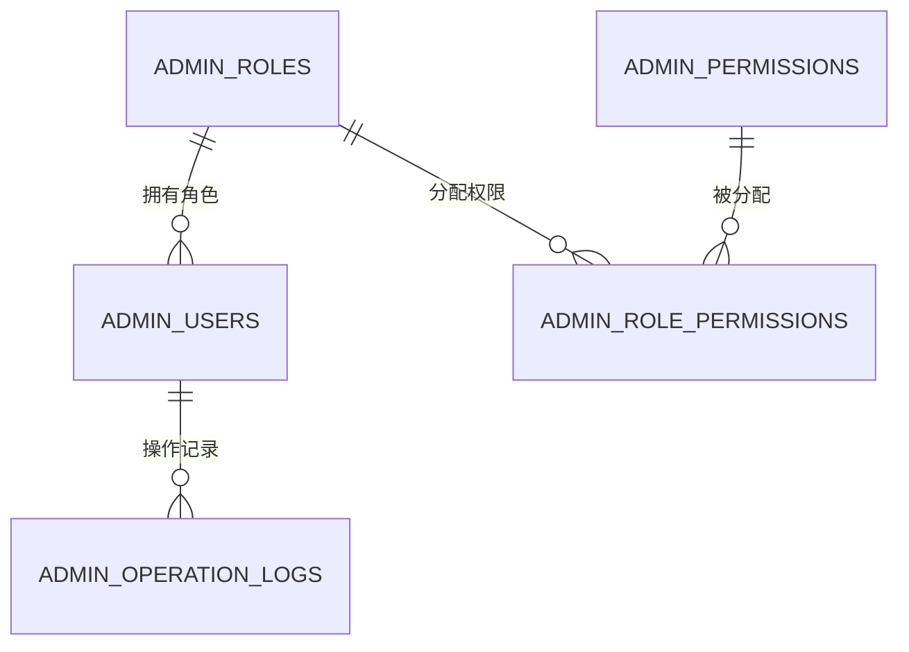
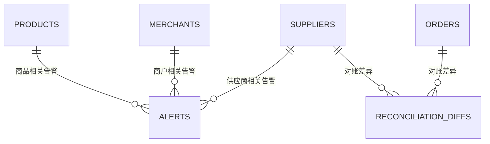

# 接口开放平台 数据库设计

> 依据：[requirements.md](requirements.md) v1.7（2026-09-14）
> 状态：草案，待评审。评审通过后按[分期计划](requirements.md#10-分期计划)拆成迁移文件（`migrations/`）落地。

## 目录

1. [设计约定](#1-设计约定)
2. [表总览](#2-表总览)
3. [ER 图](#3-er-图)
4. [表结构](#4-表结构)
   - [4.1 管理员与权限](#41-管理员与权限)
   - [4.2 商户](#42-商户)
   - [4.3 资金](#43-资金)
   - [4.4 供应商](#44-供应商)
   - [4.5 本地商品（话费、卡券）](#45-本地商品话费卡券)
   - [4.6 订单核心](#46-订单核心)
   - [4.7 订单业务线明细](#47-订单业务线明细)
   - [4.8 返佣](#48-返佣)
   - [4.9 售后](#49-售后)
   - [4.10 回调与调用日志](#410-回调与调用日志)
   - [4.11 电影票基础数据缓存](#411-电影票基础数据缓存)
   - [4.12 系统设置](#412-系统设置)
   - [4.13 定价规则](#413-定价规则)
   - [4.14 告警](#414-告警)
   - [4.15 对账](#415-对账)
5. [关键设计说明](#5-关键设计说明)
6. [按分期建表](#6-按分期建表)
7. [待确认](#7-待确认)

---

## 1. 设计约定

沿用项目现有约定（见 [migrations/2026_09_10_080028_create_users_table.php](../migrations/2026_09_10_080028_create_users_table.php)、[app/Model/User.php](../app/Model/User.php)）：

| 项目 | 约定 |
|---|---|
| 主键 | `id`，`bigIncrements`（`BIGINT UNSIGNED AUTO_INCREMENT`） |
| 表名 / 字段名 | 全部 `snake_case`，表名用复数 |
| 时间戳 | 统一用 `$table->datetimes()` 生成 `created_at` / `updated_at`；额外的业务时间点单独建 `xxx_at` 字段，可为空 |
| 金额 | `DECIMAL(10,2)`，**禁止用浮点数**（对应 [9. 非功能需求](requirements.md#9-非功能需求)） |
| 比例（返佣比例、加价百分比） | `DECIMAL(6,4)`，存小数（如 `0.8000` = 80%），不存百分比整数；电影票、快递允许超过 `1.0000`（对应 [5.5](requirements.md#55-价格与返佣保护) 的超 100% 提示） |
| 枚举字段 | 数据库层用 `VARCHAR` + 应用层枚举类维护取值，不用 MySQL 原生 `ENUM`（改值不用改表结构） |
| 外键 | 本文档里"外键 `x.id`"只表示**逻辑关联**，不在数据库层加 `FOREIGN KEY` 约束（现有 `users` 表迁移也没有用），关联字段仍然建普通索引；由应用层（Dao/Service）保证引用完整性。这样能用 `0`/占位值表示"不特指某一行"（如 [`supplier_circuit_breakers.product_id`](#44-供应商)），也避免大表之间的级联约束拖慢批量写入 |
| 加密字段 | `AppSecret`、供应商密钥、卡密（`card_no`/`card_pwd`）用 `VARBINARY`/`TEXT` 存密文，应用层加解密，不做数据库层字段级加密；算法与密钥管理见 [5.3](#53-供应商配置和商户密钥的加密) |
| JSON 字段 | 结构不固定、不需要单独查询/建索引的（座位数据、快照 JSON、供应商原始报文）用 `JSON` 类型；需要按字段查询/建索引的一律拆成独立列 |
| 软删除 | 不用软删除；商户/供应商/商品等用 `status` 字段表达启用/停用/下架，保留历史订单的可追溯性 |
| 快照字段 | 订单表内的 `sale_price`、`cost_price` 等是**下单时的快照**，之后改价格/返佣配置不影响历史订单（对应 [5.1](requirements.md#51-售价)） |
| 幂等键 | 商户订单号 `(merchant_id, merchant_order_no)` 唯一索引；供应商单号在对应明细表里唯一（供应商侧防重复） |
| 字符集 | 建议 `utf8mb4`（当前 `config/autoload/databases.php` 默认是 `utf8`，存中文没问题但不支持 emoji/生僻字，建议后续统一改成 `utf8mb4`，不在本次设计范围内改动配置文件） |

---

## 2. 表总览

| 模块 | 表名 | 用途 |
|---|---|---|
| 管理员与权限 | `admin_users` | 后台管理员账号 |
| | `admin_roles` | 角色（自定义，预置超管/运营/财务/客服） |
| | `admin_permissions` | 权限项目录（菜单 + 操作） |
| | `admin_role_permissions` | 角色-权限关联 |
| | `admin_operation_logs` | 后台操作日志 |
| 商户 | `merchants` | 商户账号与账户余额 |
| | `merchant_qualifications` | 商户资质资料（企业/个人，含历史提交） |
| | `merchant_levels` | 商户等级 |
| | `merchant_level_business_rates` | 等级在各业务线的返佣比例 |
| | `merchant_business_subscriptions` | 商户业务线开通申请与状态 |
| | `merchant_rate_limits` | 商户单独限流配置（覆盖全局默认） |
| 资金 | `merchant_recharge_requests` | 充值申请与审核 |
| | `merchant_balance_logs` | 资金流水（唯一权威来源） |
| 供应商 | `suppliers` | 供应商配置（单选业务线） |
| | `supplier_circuit_breakers` | 熔断状态（可精确到供应商+商品） |
| | `supplier_call_logs` | 调用供应商的原始请求/响应日志 |
| 本地商品 | `products` | 话费、卡券本地商品 |
| | `product_level_rebates` | 商品单独设置某等级返佣比例 |
| | `supplier_products` | 商品在各供应商的映射、成本价、优先级 |
| | `supplier_product_price_history` | 供应商商品成本价变更历史 |
| 订单核心 | `orders` | 订单主表，四条业务线共用 |
| | `order_attempts` | 订单在各供应商的尝试记录（路由切换历史） |
| 订单明细 | `order_recharges` | 话费、卡券专属明细 |
| | `order_movies` | 电影票专属明细 |
| | `order_expresses` | 快递专属明细 |
| | `order_express_fee_adjustments` | 快递费用调整记录 |
| 返佣 | `merchant_rebates` | 商户返佣记录（待到账/已到账/已作废/已扣回） |
| 售后 | `aftersale_disputes` | 话费、卡券未到账争议 |
| | `express_workorders` | 快递工单（客服代提交） |
| 日志 | `merchant_notify_logs` | 回调商户的请求/响应日志 |
| | `supplier_notify_logs` | 收到供应商回调的原始记录 |
| 电影票缓存 | `movie_cities` | 城市缓存 |
| | `movie_regions` | 行政区/县缓存 |
| | `movie_cinemas` | 影院缓存 |
| | `movie_showtime_caches` | 场次缓存（可选，取决于是否申请到批量拉取权限） |
| 系统设置 | `system_settings` | 全局可配参数（key-value） |
| 定价规则 | `pricing_rules` | 电影票、快递的加价规则（对应 [8.3](requirements.md#83-系统管理后台webadmin)"价格设置"） |
| 告警 | `alerts` | 告警记录（对应 [8.3](requirements.md#83-系统管理后台webadmin)"告警"的 7 类场景） |
| 对账 | `reconciliation_diffs` | 订单对账、返佣对账标出的差异，支持标记处理状态 |

共 39 张表（其中 `movie_showtime_caches` 为可选表）。

---

## 3. ER 图

### 3.1 商户、资金、等级

### 3.2 供应商与商品

### 3.3 订单核心与业务线明细

### 3.4 返佣、售后、回调日志

### 3.5 电影票基础数据缓存

### 3.6 管理员与权限

`system_settings` 是独立的 key-value 配置表，不参与关联，未画入 ER 图。

### 3.7 定价规则、告警与对账

`pricing_rules` 只有电影票、快递两条业务线各一条当前生效的规则，不关联其他表，未画入 ER 图。`alerts` 的 `related_type`/`related_id` 是弱关联（不分表存外键），图中只示意常见的三种关联对象。

---

## 4. 表结构

### 4.1 管理员与权限

#### `admin_users`

| 字段 | 类型 | 必填 | 说明 |
|---|---|---|---|
| id | bigint unsigned | 是 | 主键 |
| username | varchar(64) | 是 | 登录账号，唯一索引 |
| password | varchar(255) | 是 | 密码哈希 |
| real_name | varchar(64) | 是 | 姓名 |
| role_id | bigint unsigned | 是 | 外键 `admin_roles.id` |
| status | varchar(16) | 是 | `active` 启用 / `disabled` 禁用 |
| last_login_at | datetime | 否 | 最近登录时间 |
| created_at / updated_at | datetime | 是 | |

索引：`username` 唯一；`role_id`。

#### `admin_roles`

| 字段 | 类型 | 必填 | 说明 |
|---|---|---|---|
| id | bigint unsigned | 是 | 主键 |
| name | varchar(32) | 是 | 角色名称，唯一；预置超级管理员/运营/财务/客服 |
| is_system | tinyint(1) | 是 | 是否预置角色，预置角色不可删除 |
| remark | varchar(255) | 否 | 备注 |
| created_at / updated_at | datetime | 是 | |

#### `admin_permissions`

| 字段 | 类型 | 必填 | 说明 |
|---|---|---|---|
| id | bigint unsigned | 是 | 主键 |
| code | varchar(64) | 是 | 权限编码，唯一，如 `merchant.view`、`merchant.adjust_balance` |
| module | varchar(32) | 是 | 所属模块，如 `商户管理` |
| name | varchar(64) | 是 | 显示名称 |
| type | varchar(16) | 是 | `menu` 菜单 / `action` 操作 |
| created_at / updated_at | datetime | 是 | |

权限目录随功能开发逐步录入（种子数据），不需要运营在前台创建。

#### `admin_role_permissions`

| 字段 | 类型 | 必填 | 说明 |
|---|---|---|---|
| id | bigint unsigned | 是 | 主键 |
| role_id | bigint unsigned | 是 | 外键 `admin_roles.id` |
| permission_id | bigint unsigned | 是 | 外键 `admin_permissions.id` |

索引：`(role_id, permission_id)` 唯一。

#### `admin_operation_logs`

| 字段 | 类型 | 必填 | 说明 |
|---|---|---|---|
| id | bigint unsigned | 是 | 主键 |
| admin_user_id | bigint unsigned | 是 | 操作人 |
| module | varchar(32) | 是 | 操作模块（商户/资金/供应商/价格/等级/返佣/系统设置…） |
| action | varchar(64) | 是 | 操作类型，如 `update_price`、`adjust_balance` |
| target_type | varchar(32) | 否 | 操作对象类型，如 `merchant`、`product` |
| target_id | bigint unsigned | 否 | 操作对象 ID |
| before_data | json | 否 | 变更前快照 |
| after_data | json | 否 | 变更后快照 |
| ip | varchar(45) | 否 | 操作来源 IP |
| created_at | datetime | 是 | |

索引：`(module, target_type, target_id)`、`admin_user_id`、`created_at`。资金、售价、等级、返佣、供应商配置、系统参数相关操作**必须**记录（对应 [9. 非功能需求](requirements.md#9-非功能需求)）。

### 4.2 商户

#### `merchants`

| 字段 | 类型 | 必填 | 说明 |
|---|---|---|---|
| id | bigint unsigned | 是 | 主键，即"商户 ID" |
| type | varchar(16) | 是 | `company` 企业 / `individual` 个人 |
| phone | varchar(20) | 否 | 登录手机号，唯一索引（允许为空但与 email 至少填一个，应用层校验） |
| email | varchar(128) | 否 | 登录邮箱，唯一索引 |
| password | varchar(255) | 是 | 密码哈希 |
| status | varchar(16) | 是 | `pending` 待审核 / `active` 已启用 / `rejected` 已驳回 / `disabled` 已禁用 |
| level_id | bigint unsigned | 否 | 外键 `merchant_levels.id`，审核通过时分配，之后运营可调整 |
| app_key | varchar(64) | 否 | 公开标识，审核通过后生成，唯一索引 |
| app_secret | varchar(255) | 否 | **加密存储**，生成时明文只展示一次 |
| app_secret_reset_at | datetime | 否 | 最近一次重置时间 |
| ip_whitelist | json | 否 | IP 白名单列表 |
| available_balance | decimal(10,2) | 是 | 可用余额，默认 0 |
| frozen_balance | decimal(10,2) | 是 | 冻结余额，默认 0 |
| debt_since | datetime | 否 | 可用余额变为负数的起始时间，为负时暂停下单；恢复后清空 |
| created_at / updated_at | datetime | 是 | |

索引：`phone`、`email`、`app_key` 唯一；`level_id`、`status`。

> 余额直接放在 `merchants` 表上（而不是单独一张账户表）：一个商户只有一份余额，减少一次 JOIN；调整余额时对这一行加行锁（`SELECT ... FOR UPDATE`），满足 [9. 非功能需求](requirements.md#9-非功能需求)"先锁商户账户再检查和修改"。

#### `merchant_qualifications`

| 字段 | 类型 | 必填 | 说明 |
|---|---|---|---|
| id | bigint unsigned | 是 | 主键 |
| merchant_id | bigint unsigned | 是 | 外键 `merchants.id` |
| type | varchar(16) | 是 | `company` / `individual`，提交时的类型 |
| company_name | varchar(128) | 否 | 企业：公司名称 |
| business_license_no | varchar(64) | 否 | 企业：营业执照号 |
| business_license_image | varchar(255) | 否 | 企业：营业执照图片 URL |
| legal_person_name | varchar(64) | 否 | 企业：法人姓名 |
| contact_name | varchar(64) | 否 | 联系人姓名（企业）或本人姓名（个人） |
| contact_phone | varchar(20) | 是 | 联系电话 |
| id_card_name | varchar(64) | 否 | 个人：姓名 |
| id_card_no | varchar(32) | 否 | 个人：身份证号，**加密存储** |
| id_card_images | json | 否 | 个人：身份证正反面图片 URL |
| status | varchar(16) | 是 | `pending` 待审核 / `approved` 通过 / `rejected` 驳回 |
| reject_reason | varchar(255) | 否 | 驳回原因 |
| reviewed_by | bigint unsigned | 否 | 外键 `admin_users.id` |
| reviewed_at | datetime | 否 | |
| created_at / updated_at | datetime | 是 | |

索引：`(merchant_id, created_at)`。允许多条历史记录（驳回后重新提交），取最新一条为当前状态。

#### `merchant_levels`

| 字段 | 类型 | 必填 | 说明 |
|---|---|---|---|
| id | bigint unsigned | 是 | 主键 |
| name | varchar(32) | 是 | 等级名称，唯一，如"金牌" |
| remark | varchar(255) | 否 | 备注 |
| created_at / updated_at | datetime | 是 | |

#### `merchant_level_business_rates`

| 字段 | 类型 | 必填 | 说明 |
|---|---|---|---|
| id | bigint unsigned | 是 | 主键 |
| level_id | bigint unsigned | 是 | 外键 `merchant_levels.id` |
| business_line | varchar(16) | 是 | `recharge` 话费 / `card` 卡券 / `movie` 电影票 / `express` 快递 |
| rebate_rate | decimal(6,4) | 是 | 该等级在此业务线的返佣比例 |
| created_at / updated_at | datetime | 是 | |

索引：`(level_id, business_line)` 唯一。

#### `merchant_business_subscriptions`

| 字段 | 类型 | 必填 | 说明 |
|---|---|---|---|
| id | bigint unsigned | 是 | 主键 |
| merchant_id | bigint unsigned | 是 | 外键 `merchants.id` |
| business_line | varchar(16) | 是 | 同上 |
| status | varchar(16) | 是 | `pending` 待审核 / `approved` 已通过 / `rejected` 已驳回 |
| applied_at | datetime | 是 | 申请时间 |
| reviewed_by | bigint unsigned | 否 | 外键 `admin_users.id` |
| reviewed_at | datetime | 否 | |
| reject_reason | varchar(255) | 否 | |
| created_at / updated_at | datetime | 是 | |

索引：`(merchant_id, business_line)` 唯一（同一业务线不重复申请，驳回后允许更新这一条重新提交）。开放 API 下单前校验 `status = approved`。

#### `merchant_rate_limits`

| 字段 | 类型 | 必填 | 说明 |
|---|---|---|---|
| merchant_id | bigint unsigned | 是 | 主键兼外键 `merchants.id` |
| limit_per_second | int unsigned | 是 | 单独限流值，覆盖全局默认（`system_settings` 里的默认值） |
| updated_at | datetime | 是 | |

只有被单独调整过限流的商户才有记录，没有记录的走全局默认值。

### 4.3 资金

#### `merchant_recharge_requests`

| 字段 | 类型 | 必填 | 说明 |
|---|---|---|---|
| id | bigint unsigned | 是 | 主键 |
| merchant_id | bigint unsigned | 是 | 外键 `merchants.id` |
| amount | decimal(10,2) | 是 | 申请充值金额 |
| proof_image | varchar(255) | 是 | 打款凭证截图 URL |
| transfer_no | varchar(64) | 否 | 转账流水号 |
| status | varchar(16) | 是 | `pending` 待审核 / `approved` 已通过 / `rejected` 已驳回 |
| reject_reason | varchar(255) | 否 | |
| reviewed_by | bigint unsigned | 否 | 外键 `admin_users.id` |
| reviewed_at | datetime | 否 | |
| created_at / updated_at | datetime | 是 | |

索引：`(merchant_id, status)`。审核通过时触发一条 `merchant_balance_logs`（`type=recharge`）并增加 `merchants.available_balance`。

#### `merchant_balance_logs`

资金流水，**唯一权威来源**，所有余额变动都要落一条记录。

| 字段 | 类型 | 必填 | 说明 |
|---|---|---|---|
| id | bigint unsigned | 是 | 主键 |
| merchant_id | bigint unsigned | 是 | 外键 `merchants.id` |
| type | varchar(24) | 是 | `recharge` 充值 / `freeze` 冻结 / `deduct` 扣款 / `unfreeze` 解冻 / `supplement_deduct` 补扣 / `refund` 退款 / `adjustment` 调账 / `rebate_settle` 返佣入账 / `rebate_clawback` 返佣扣回 |
| amount | decimal(10,2) | 是 | 本次变动金额，正数为增加对应余额，负数为减少（含义按 `type` 解释，见 [4.4 账户余额](requirements.md#44-账户余额)） |
| available_before | decimal(10,2) | 是 | 变动前可用余额 |
| available_after | decimal(10,2) | 是 | 变动后可用余额 |
| frozen_before | decimal(10,2) | 是 | 变动前冻结余额 |
| frozen_after | decimal(10,2) | 是 | 变动后冻结余额 |
| order_id | bigint unsigned | 否 | 外键 `orders.id`，冻结/扣款/解冻/补扣/退款/返佣类必填 |
| rebate_id | bigint unsigned | 否 | 外键 `merchant_rebates.id`，返佣入账/扣回类必填 |
| reason | varchar(255) | 否 | 调账原因、退款原因等 |
| operator_id | bigint unsigned | 否 | 外键 `admin_users.id`，人工操作（调账）时必填 |
| dedupe_order_key | varchar(80) | 否 | **生成列**：`type` 为 `deduct`/`unfreeze` 时等于 `CONCAT(order_id,'-',type)`，其余类型为 `NULL` |
| dedupe_rebate_key | varchar(80) | 否 | **生成列**：`type` 为 `rebate_settle`/`rebate_clawback` 时等于 `CONCAT(rebate_id,'-',type)`，其余类型为 `NULL` |
| created_at | datetime | 是 | |

索引：`(merchant_id, created_at)`、`order_id`、`rebate_id`；`dedupe_order_key` 唯一、`dedupe_rebate_key` 唯一（见下）。

**幂等约束**（对应 [9. 非功能需求](requirements.md#9-非功能需求)"每笔冻结金额只能处理一次；每条商户返佣只能入账一次、只能扣回一次"）：

- MySQL 的唯一索引不支持"只对某些枚举值生效"的条件唯一索引，也不能直接对 `(order_id, type)` 建全局唯一索引——`refund`（快递可能多次费用退回）、`supplement_deduct`（快递可能多次补扣）本来就允许同一 `order_id` 出现多条。
- 做法是加两个**生成列**（`STORED GENERATED COLUMN`）：`dedupe_order_key` 只在 `type IN ('deduct','unfreeze')` 时才有值，其余类型为 `NULL`；`dedupe_rebate_key` 只在 `type IN ('rebate_settle','rebate_clawback')` 时才有值。MySQL 唯一索引不把多个 `NULL` 视为冲突，所以对这两列分别建 `UNIQUE` 索引后：不受限的类型永远是 `NULL`、可以重复插入；受限的类型一旦重复插入相同 `order_id`/`rebate_id` + `type` 组合就会因唯一冲突报错，从而拦住重复扣款/重复解冻/重复入账/重复扣回。

### 4.4 供应商

#### `suppliers`

| 字段 | 类型 | 必填 | 说明 |
|---|---|---|---|
| id | bigint unsigned | 是 | 主键 |
| name | varchar(64) | 是 | 供应商名称 |
| code | varchar(32) | 是 | 编码，唯一，**创建后不可改**，用于回调地址 `/notify/{code}` |
| notify_token | varchar(64) | 是 | 回调地址里的随机令牌，创建时自动生成：`/notify/{code}/{notify_token}`（2026-09-18 加） |
| business_line | varchar(16) | 是 | **单选**：`recharge` 话费 / `card` 卡券 / `movie` 电影票 / `express` 快递（2026-09-14 确认，一条供应商记录只属于一条业务线） |
| driver | varchar(32) | 是 | 对接驱动：`kasushou`（卡速售 2.0）/ `yunyang`（云洋）/ `mango`（芒果） |
| config | text | 是 | 接口地址、账号、密钥等配置，**加密存储**（JSON 加密后的密文） |
| status | varchar(16) | 是 | `active` 启用 / `disabled` 停用 |
| balance | decimal(10,2) | 否 | 最近一次查询到的供应商预存款余额（缓存） |
| balance_synced_at | datetime | 否 | 余额最近同步时间 |
| balance_warning_threshold | decimal(10,2) | 否 | 余额预警阈值 |
| contact | varchar(128) | 否 | 线下联系人 |
| settlement_info | varchar(255) | 否 | 结算方式 |
| remark | text | 否 | 备注 |
| created_at / updated_at | datetime | 是 | |

索引：`code` 唯一；`(business_line, status)`（路由取某业务线下的可用供应商）；`driver`。

> **同一个实际供应商账号覆盖多条业务线，就插入多条 `suppliers` 记录**，`config` 里的账号密钥可以填成一样的，`code` 各自唯一（如 `kasushou_a_recharge`、`kasushou_a_card`）。这几条记录之间没有数据库层面的关联，靠 `name`/`remark` 或后台 UI 分组展示来体现"同一个供应商"，`balance` 各自独立查询（见 [6.7 余额监控](requirements.md#67-余额监控)）。
>
> **`driver` 不按业务线拆分值**（如不拆成 `kasushou_recharge`/`kasushou_card`）：`driver` 表示"用哪套接口代码"，`business_line` 表示"这条记录服务哪条线"，两者正交、各存一列，避免同一个信息被编码两遍。后台新增供应商表单可以把两者合并展示成一个下拉选项（如"卡速售 2.0 - 话费"），选中后仍分别回填 `driver` 和 `business_line` 两个字段提交，兼顾界面易用性和数据结构的清晰。

#### `supplier_circuit_breakers`

| 字段 | 类型 | 必填 | 说明 |
|---|---|---|---|
| id | bigint unsigned | 是 | 主键 |
| supplier_id | bigint unsigned | 是 | 外键 `suppliers.id` |
| product_id | bigint unsigned | 是 | 外键 `products.id`，**用 `0` 表示"整个供应商"熔断**，非 0 表示精确到"供应商+商品" |
| status | varchar(16) | 是 | `normal` 正常 / `paused` 熔断中 |
| paused_until | datetime | 否 | 暂停截止时间，到期自动恢复 |
| triggered_reason | varchar(255) | 否 | 触发原因（失败率快照） |
| created_at / updated_at | datetime | 是 | |

索引：`(supplier_id, product_id)` 唯一。**`product_id` 不用 `NULL`**：MySQL 的唯一索引不会把多个 `NULL` 当作重复值拦截，如果用 `NULL` 表示"整个供应商"，会出现同一供应商被插入多条全局熔断记录而不报错；改用 `0` 作为"整个供应商"的哨兵值，唯一索引才能真正生效。

#### `supplier_call_logs`

| 字段 | 类型 | 必填 | 说明 |
|---|---|---|---|
| id | bigint unsigned | 是 | 主键 |
| supplier_id | bigint unsigned | 是 | 外键 `suppliers.id` |
| order_id | bigint unsigned | 否 | 外键 `orders.id`，查余额/同步商品等非订单相关调用为空 |
| action | varchar(32) | 是 | `place_order` 下单 / `query` 查询订单 / `query_balance` 查余额 / `cancel` 撤单等 |
| request | json | 是 | 请求内容（卡密类字段打码） |
| response | json | 否 | 响应内容（卡密类字段打码） |
| duration_ms | int unsigned | 否 | 耗时 |
| created_at | datetime | 是 | |

索引：`(order_id, created_at)`、`(supplier_id, created_at)`。高写入量表，建议按月分区或定期归档（见 [9. 非功能需求](requirements.md#9-非功能需求)"预留历史订单归档方案"）。

### 4.5 本地商品（话费、卡券）

#### `products`

| 字段 | 类型 | 必填 | 说明 |
|---|---|---|---|
| id | bigint unsigned | 是 | 主键 |
| business_line | varchar(16) | 是 | `recharge` 话费 / `card` 卡券 |
| name | varchar(128) | 是 | 商品名称，如"移动 100 元快充" |
| operator | varchar(16) | 否 | 运营商，话费专用：`mobile`/`unicom`/`telecom` |
| province | varchar(32) | 否 | 适用省份，话费可能按省份区分 |
| charge_speed | varchar(16) | 否 | 话费专用：`fast` 快充 / `slow` 慢充 |
| card_type | varchar(16) | 否 | 卡券专用：`direct` 直充 / `card_secret` 卡密 |
| face_value | decimal(10,2) | 是 | 面值 |
| sale_price | decimal(10,2) | 是 | 售价，对所有商户统一 |
| rebate_amount | decimal(10,2) | 是 | 商品返佣金额，默认 0 |
| applicable_region | varchar(64) | 否 | 适用地区说明 |
| status | varchar(16) | 是 | `on_shelf` 上架 / `off_shelf` 下架 |
| created_at / updated_at | datetime | 是 | |

索引：`(business_line, status)`。**没有任何启用的供应商映射时不能上架**（应用层在上架校验时检查，不做数据库约束）。

#### `product_level_rebates`

| 字段 | 类型 | 必填 | 说明 |
|---|---|---|---|
| id | bigint unsigned | 是 | 主键 |
| product_id | bigint unsigned | 是 | 外键 `products.id` |
| level_id | bigint unsigned | 是 | 外键 `merchant_levels.id` |
| rebate_rate | decimal(6,4) | 是 | 覆盖该等级在此商品上的返佣比例 |
| created_at / updated_at | datetime | 是 | |

索引：`(product_id, level_id)` 唯一。取返佣比例时优先查这张表，没有再退回 `merchant_level_business_rates`（见 [5.3](requirements.md#53-返佣计算)）。

#### `supplier_products`

| 字段 | 类型 | 必填 | 说明 |
|---|---|---|---|
| id | bigint unsigned | 是 | 主键 |
| product_id | bigint unsigned | 是 | 外键 `products.id` |
| supplier_id | bigint unsigned | 是 | 外键 `suppliers.id` |
| supplier_product_code | varchar(64) | 是 | 供应商侧商品编码 |
| cost_price | decimal(10,2) | 是 | 成本价 |
| priority | int unsigned | 是 | 优先级，数字越小越优先 |
| status | varchar(16) | 是 | `active` 启用 / `paused` 暂停 / `banned` 禁售 |
| stock | int | 否 | 库存，为空表示不限 |
| param_mapping | json | 否 | 下单参数映射（平台参数 → 供应商字段名） |
| sale_restrictions | json | 否 | 销售限制（可售/禁售渠道、销售限价），**不展示给商户** |
| synced_at | datetime | 否 | 最近一次自动同步时间 |
| created_at / updated_at | datetime | 是 | |

索引：`(product_id, priority)`、`(supplier_id, status)`；`(product_id, supplier_id)` 唯一。路由时按 `(product_id, priority)` 取启用且未熔断、未禁售、库存非 0 的供应商。

**一致性校验**（应用层，不做数据库约束）：新增/编辑映射时要检查 `suppliers.business_line` 与 `products.business_line` 一致——供应商现在单选业务线，不能把一个话费商品映射到一条只开通了卡券的供应商记录上。

#### `supplier_product_price_history`

| 字段 | 类型 | 必填 | 说明 |
|---|---|---|---|
| id | bigint unsigned | 是 | 主键 |
| supplier_product_id | bigint unsigned | 是 | 外键 `supplier_products.id` |
| old_price | decimal(10,2) | 否 | 变更前成本价 |
| new_price | decimal(10,2) | 是 | 变更后成本价 |
| source | varchar(16) | 是 | `sync` 自动同步 / `manual` 人工录入 |
| created_at | datetime | 是 | 变更时间 |

索引：`(supplier_product_id, created_at)`。

### 4.6 订单核心

#### `orders`

四条业务线共用的主表，业务线专属字段拆到 [4.7](#47-订单业务线明细) 的明细表。

| 字段 | 类型 | 必填 | 说明 |
|---|---|---|---|
| id | bigint unsigned | 是 | 主键 |
| order_no | varchar(32) | 是 | 平台订单号，对外展示，唯一 |
| merchant_id | bigint unsigned | 是 | 外键 `merchants.id` |
| merchant_order_no | varchar(64) | 是 | 商户订单号 |
| business_line | varchar(16) | 是 | `recharge`/`card`/`movie`/`express` |
| status | varchar(16) | 是 | `processing` 处理中 / `success` 成功 / `failed` 失败 / `cancelled` 已取消 / `abnormal` 异常 / `refunded` 已退款 |
| sale_price | decimal(10,2) | 是 | 售价快照（快递为预估售价，结算后可能不等于最终扣款） |
| cost_price | decimal(10,2) | 是 | 成本快照：话费/卡券在下单时按所选供应商商品的成本价写入；电影票在锁座时按实时查询到的场次成本写入（锁座成功后成本已锁定，不会再变）；快递下单时先写入**预估**运费成本，供应商完成扣费后更新为**实际**成本 |
| supplier_id | bigint unsigned | 否 | 最终成交/最后尝试的供应商，外键 `suppliers.id` |
| supplier_order_no | varchar(128) | 否 | 供应商侧订单号 |
| frozen_amount | decimal(10,2) | 是 | 冻结金额 |
| deducted_amount | decimal(10,2) | 否 | 实际扣款金额（快递按最终结算金额，可能与 `sale_price` 不同） |
| refunded_amount | decimal(10,2) | 是 | 已退款金额，默认 0 |
| callback_url | varchar(255) | 是 | 商户下单时传入的回调地址 |
| fail_reason | varchar(255) | 否 | 失败原因（平台统一文案，不透传供应商原始信息） |
| completed_at | datetime | 否 | **订单完成时间**（返佣起算点），见 [7.5](requirements.md#75-订单完成时间) |
| finished_at | datetime | 否 | 订单进入终态（成功/失败/取消/已退款）的时间 |
| created_at / updated_at | datetime | 是 | |

索引：
- `order_no` 唯一
- `(merchant_id, merchant_order_no)` 唯一（幂等：重复提交直接返回已有订单）
- `(merchant_id, status, created_at)`（商户订单列表筛选）
- `(business_line, status)`
- `(supplier_id, status)`
- `(status, completed_at)`（异常单扫描、对账用）
- `finished_at`（每日对账按「当天进入终态」取订单，2026-09-21 补；`completed_at` 只有成功的订单才有，代替不了它，见 `App\Dao\OrderDao::listFinishedBetween()`）

#### `order_attempts`

| 字段 | 类型 | 必填 | 说明 |
|---|---|---|---|
| id | bigint unsigned | 是 | 主键 |
| order_id | bigint unsigned | 是 | 外键 `orders.id` |
| supplier_id | bigint unsigned | 是 | 外键 `suppliers.id` |
| attempt_no | int unsigned | 是 | 第几次尝试（同一订单从 1 递增） |
| result | varchar(16) | 是 | `success` 成功 / `failed` 明确失败 / `processing` 处理中 / `unknown` 结果未知 |
| fail_reason | varchar(255) | 否 | 失败原因 |
| request_snapshot | json | 否 | 下单请求快照 |
| response_snapshot | json | 否 | 下单响应快照 |
| created_at / updated_at | datetime | 是 | `updated_at` 记录该次尝试结果最后更新时间（处理中 → 成功/失败） |

索引：`(order_id, attempt_no)` 唯一。话费、卡券路由切换会产生多条；电影票、快递目前只有一家供应商，最多一条。

### 4.7 订单业务线明细

#### `order_recharges`（话费、卡券）

| 字段 | 类型 | 必填 | 说明 |
|---|---|---|---|
| order_id | bigint unsigned | 是 | 主键兼外键 `orders.id` |
| product_id | bigint unsigned | 是 | 外键 `products.id` |
| recharge_account | varchar(32) | 否 | 充值账号/手机号（卡密类可为空） |
| card_no | varchar(255) | 否 | 卡号，**加密存储** |
| card_pwd | varchar(255) | 否 | 卡密，**加密存储** |
| rebate_amount | decimal(10,2) | 是 | 商品返佣金额快照 |

#### `order_movies`（电影票）

| 字段 | 类型 | 必填 | 说明 |
|---|---|---|---|
| order_id | bigint unsigned | 是 | 主键兼外键 `orders.id` |
| cinema_id | varchar(32) | 是 | 影院 ID（查询时使用的 ID，非场次记录自带的） |
| cinema_name | varchar(128) | 否 | 影院名称快照 |
| film_id | varchar(32) | 是 | 影片 ID（同上，查询时使用的 ID） |
| film_name | varchar(128) | 否 | 影片名称快照 |
| show_id | varchar(255) | 是 | 场次 ID（供应商 `showid`，可能含特殊字符） |
| show_time | datetime | 是 | 场次开场时间 |
| area_id | varchar(32) | 否 | 分区 ID，不分区为空 |
| seats | json | 是 | 座位列表（座位号、行列坐标、情侣座标记） |
| seat_count | tinyint unsigned | 是 | 座位数，≤ 4 |
| lock_expire_at | datetime | 是 | 锁座有效期截止时间 |
| ticket_codes | json | 否 | 取票码/验证码，出票成功后写入 |
| supplier_rebate | decimal(10,2) | 否 | 供应商返佣（以查询订单详情接口为准） |

#### `order_expresses`（快递）

| 字段 | 类型 | 必填 | 说明 |
|---|---|---|---|
| order_id | bigint unsigned | 是 | 主键兼外键 `orders.id` |
| express_company_code | varchar(32) | 是 | 平台自己的快递公司渠道编号（不暴露供应商渠道 ID） |
| express_company_name | varchar(64) | 是 | 快递公司名称 |
| sender_info | json | 是 | 寄件人信息 |
| receiver_info | json | 是 | 收件人信息 |
| item_info | json | 是 | 物品信息 |
| weight | decimal(6,2) | 是 | 重量（kg） |
| insured_amount | decimal(10,2) | 否 | 保价金额 |
| waybill_no | varchar(64) | 否 | 供应商运单号 |
| estimated_freight | decimal(10,2) | 是 | 预估运费成本 |
| frozen_freight | decimal(10,2) | 否 | 供应商确认下单后返回的冻结运费（用于调整冻结金额） |
| actual_freight | decimal(10,2) | 否 | 实际运费（扣费后） |
| actual_insured_fee | decimal(10,2) | 否 | 实际保价费 |
| actual_material_fee | decimal(10,2) | 否 | 实际耗材费 |
| actual_reverse_fee | decimal(10,2) | 否 | 实际逆向费 |
| logistics_status | varchar(16) | 是 | `pending_pickup` 待揽收 / `in_transit` 运输中 / `signed` 已签收 / `rejected` 拒收退回 / `cancelled` 已取消 |
| fee_over_at | datetime | 否 | 供应商完成扣费时间（订单"成功"时刻） |
| signed_at | datetime | 否 | 签收时间（订单完成时间来源） |
| supplier_rebate | decimal(10,2) | 否 | 供应商返佣（当前无，预留字段） |

#### `order_express_fee_adjustments`

| 字段 | 类型 | 必填 | 说明 |
|---|---|---|---|
| id | bigint unsigned | 是 | 主键 |
| order_id | bigint unsigned | 是 | 外键 `orders.id` |
| type | varchar(16) | 是 | `supplement` 补扣 / `refund` 退回 |
| item | varchar(16) | 是 | `freight` 运费 / `insured` 保价费 / `material` 耗材费 / `reverse` 逆向费 |
| amount | decimal(10,2) | 是 | 调整金额 |
| reason | varchar(255) | 否 | 原因 |
| created_at | datetime | 是 | |

索引：`(order_id, created_at)`。

### 4.8 返佣

#### `merchant_rebates`

| 字段 | 类型 | 必填 | 说明 |
|---|---|---|---|
| id | bigint unsigned | 是 | 主键 |
| order_id | bigint unsigned | 是 | 外键 `orders.id`，一单一条 |
| merchant_id | bigint unsigned | 是 | 外键 `merchants.id` |
| business_line | varchar(16) | 是 | 冗余存一份，方便按业务线统计 |
| level_id | bigint unsigned | 是 | 下单时商户等级快照 |
| rebate_base | decimal(10,2) | 是 | 返佣基数（商品返佣金额 / 供应商返佣） |
| rebate_base_source | varchar(16) | 是 | `product` 商品配置 / `supplier` 供应商返回 |
| rebate_rate | decimal(6,4) | 是 | 返佣比例快照 |
| rebate_rate_source | varchar(16) | 是 | `product_level` 商品单独设置 / `level` 等级设置 |
| amount | decimal(10,2) | 是 | 商户返佣金额 = `rebate_base × rebate_rate`，向下取整到分 |
| status | varchar(16) | 是 | `pending` 待到账 / `settled` 已到账 / `voided` 已作废 / `clawed_back` 已扣回 |
| order_completed_at | datetime | 否 | 订单完成时间快照（生成时若未完成先空着，完成后回填） |
| due_at | datetime | 否 | 到账时间 = `order_completed_at` + 固定期限，`order_completed_at` 为空时也为空 |
| settled_at | datetime | 否 | 实际入账时间 |
| voided_at | datetime | 否 | 作废时间 |
| clawed_back_at | datetime | 否 | 扣回时间 |
| created_at / updated_at | datetime | 是 | |

索引：
- `order_id` 唯一
- `(status, due_at)`（定时任务扫描到期记录：`status='pending' AND due_at <= now()`）
- `(merchant_id, status)`

### 4.9 售后

#### `aftersale_disputes`（话费、卡券未到账争议）

| 字段 | 类型 | 必填 | 说明 |
|---|---|---|---|
| id | bigint unsigned | 是 | 主键 |
| order_id | bigint unsigned | 是 | 外键 `orders.id` |
| merchant_id | bigint unsigned | 是 | 外键 `merchants.id` |
| status | varchar(16) | 是 | `processing` 处理中 / `rejected` 已驳回 / `confirmed` 已确认未到账 |
| evidence | json | 否 | 客服核实凭证（供应商查询结果截图/文本） |
| handler_id | bigint unsigned | 否 | 外键 `admin_users.id`，处理客服 |
| result_remark | varchar(255) | 否 | 处理结果说明 |
| submitted_at | datetime | 是 | 商户提交时间 |
| resolved_at | datetime | 否 | 处理完成时间 |
| created_at / updated_at | datetime | 是 | |

索引：`order_id` 唯一（需求文档未描述"驳回后可重新提交争议"的场景，按一单只能提交一次争议设计；如果之后要支持重新提交，需要把 `order_id` 改成普通索引，应用层校验"同一订单不能同时存在两条 `processing`"）；`(merchant_id, status)`。

#### `express_workorders`（快递工单，客服代提交）

| 字段 | 类型 | 必填 | 说明 |
|---|---|---|---|
| id | bigint unsigned | 是 | 主键 |
| order_id | bigint unsigned | 是 | 外键 `orders.id` |
| type | varchar(24) | 是 | `weight_verify` 重量核实 / `claim` 理赔 / `cancel` 取消 / `cod` 现结到付 / `urge_pickup` 催取件 / `urge_transport` 催物流 / `urge_delivery` 催派送 |
| status | varchar(16) | 是 | `processing` 处理中 / `completed` 已完成 / `rejected` 已驳回 |
| supplier_workorder_no | varchar(64) | 否 | 供应商侧工单号 |
| submitted_by | bigint unsigned | 是 | 外键 `admin_users.id`，代提交的客服 |
| result_remark | varchar(255) | 否 | 处理结果 |
| claim_amount | decimal(10,2) | 否 | 理赔金额（`type=claim` 时使用，核实后通过调账加给商户） |
| created_at | datetime | 是 | |
| resolved_at | datetime | 否 | |

索引：`(order_id, type)`。

### 4.10 回调与调用日志

#### `merchant_notify_logs`

| 字段 | 类型 | 必填 | 说明 |
|---|---|---|---|
| id | bigint unsigned | 是 | 主键 |
| order_id | bigint unsigned | 是 | 外键 `orders.id` |
| url | varchar(255) | 是 | 回调地址 |
| payload | json | 是 | 通知内容（卡密打码） |
| response_body | text | 否 | 商户响应内容 |
| http_status | smallint unsigned | 否 | HTTP 状态码 |
| attempt_no | tinyint unsigned | 是 | 第几次重试（1~7：首次 + 6 次重试） |
| success | tinyint(1) | 是 | 商户是否返回 `success` |
| created_at | datetime | 是 | |

索引：`(order_id, created_at)`。用于商户后台"回调记录与手动重推"。

#### `supplier_notify_logs`

| 字段 | 类型 | 必填 | 说明 |
|---|---|---|---|
| id | bigint unsigned | 是 | 主键 |
| supplier_id | bigint unsigned | 是 | 外键 `suppliers.id` |
| order_id | bigint unsigned | 否 | 外键 `orders.id`，影院更新回调等非订单类回调为空 |
| payload | json | 是 | 回调原始内容 |
| signature_valid | tinyint(1) | 否 | 签名校验结果，供应商回调无签名时为空 |
| processed | tinyint(1) | 是 | 是否已处理（触发了查询确认） |
| created_at | datetime | 是 | |

索引：`(supplier_id, created_at)`、`order_id`。**回调只作为触发**：`processed` 只标记"是否已触发查询"，不代表资金操作已完成，真正状态以 `orders`/`order_*` 明细表为准。

### 4.11 电影票基础数据缓存

#### `movie_cities`

| 字段 | 类型 | 必填 | 说明 |
|---|---|---|---|
| id | bigint unsigned | 是 | 主键 |
| supplier_id | bigint unsigned | 是 | 外键 `suppliers.id`（预留多家供应商） |
| city_id | varchar(32) | 是 | 供应商侧城市 ID |
| city_name | varchar(64) | 是 | 城市名称 |
| first_letter | varchar(4) | 否 | 首字母 |
| is_hot | tinyint(1) | 是 | 是否热门城市 |
| synced_at | datetime | 是 | 最近同步时间 |

索引：`(supplier_id, city_id)` 唯一。

#### `movie_regions`

| 字段 | 类型 | 必填 | 说明 |
|---|---|---|---|
| id | bigint unsigned | 是 | 主键 |
| supplier_id | bigint unsigned | 是 | 外键 `suppliers.id` |
| city_id | varchar(32) | 是 | 所属城市 ID |
| region_id | varchar(32) | 是 | 供应商侧区域 ID |
| region_name | varchar(64) | 是 | 区域名称 |
| synced_at | datetime | 是 | |

索引：`(supplier_id, city_id, region_id)` 唯一。

#### `movie_cinemas`

| 字段 | 类型 | 必填 | 说明 |
|---|---|---|---|
| id | bigint unsigned | 是 | 主键 |
| supplier_id | bigint unsigned | 是 | 外键 `suppliers.id` |
| cinema_id | varchar(32) | 是 | 供应商侧影院 ID |
| cinema_code | varchar(32) | 否 | 影院专资编码 |
| cinema_name | varchar(128) | 是 | 影院名称 |
| city_id | varchar(32) | 是 | 所属城市 ID |
| region_id | varchar(32) | 否 | 所属区域 ID |
| address | varchar(255) | 否 | 详细地址 |
| tel | varchar(64) | 否 | 联系电话 |
| longitude | decimal(10,6) | 否 | 经度 |
| latitude | decimal(10,6) | 否 | 纬度 |
| service_info | json | 否 | 影院服务信息 |
| synced_at | datetime | 是 | 最近一次批量同步时间 |
| callback_synced_at | datetime | 否 | 最近一次"影院更新回调"增量同步时间 |

索引：`(supplier_id, cinema_id)` 唯一；`(city_id, region_id)`。

#### `movie_showtime_caches`（可选）

仅在申请到「批量拉取场次数据」权限时启用，用于按影院预拉取缓存；未申请到权限则不建这张表，场次查询全部实时转发。

| 字段 | 类型 | 必填 | 说明 |
|---|---|---|---|
| id | bigint unsigned | 是 | 主键 |
| supplier_id | bigint unsigned | 是 | 外键 `suppliers.id` |
| cinema_id | varchar(32) | 是 | 查询时使用的影院 ID（非场次记录自带的） |
| film_id | varchar(32) | 是 | 查询时使用的影片 ID（同上） |
| show_id | varchar(255) | 是 | 场次 ID |
| hall_name | varchar(64) | 否 | 影厅名称 |
| show_time | datetime | 是 | 开场时间 |
| stop_sell_time | datetime | 否 | 停售时间 |
| plan_type | varchar(16) | 否 | 2D/3D 等 |
| cost_price | decimal(10,2) | 是 | 不分区时的成本（结算价） |
| area_price | json | 否 | 分区价格信息 |
| synced_at | datetime | 是 | |

索引：`(supplier_id, cinema_id, film_id)`；`show_id` 唯一。座位数据不缓存，不建表。

### 4.12 系统设置

#### `system_settings`

| 字段 | 类型 | 必填 | 说明 |
|---|---|---|---|
| `key` | varchar(64) | 是 | 主键，参数名，如 `switch_duration_minutes` |
| value | text | 是 | 参数值（JSON 或标量的字符串形式，应用层按 key 约定的类型解析） |
| description | varchar(255) | 否 | 说明 |
| updated_by | bigint unsigned | 否 | 外键 `admin_users.id` |
| updated_at | datetime | 是 | |

预置 key（种子数据）：

| key | 说明 | 默认值 |
|---|---|---|
| `switch_duration_minutes` | 供应商切换时长 | 30 |
| `abnormal_order_hours` | 异常单时长 | 24 |
| `circuit_breaker_window_minutes` | 熔断统计窗口 | 10 |
| `circuit_breaker_min_orders` | 熔断最小订单数 | 20 |
| `circuit_breaker_fail_rate` | 熔断失败率阈值 | 0.5000 |
| `circuit_breaker_pause_minutes` | 熔断暂停时长 | 5 |
| `default_rate_limit_per_second` | 默认限流 | 50 |
| `debt_warning_threshold` | 欠款预警线 | 运营配置，无默认 |
| `dispute_deadline_days` | 售后争议时限 | 7 |
| `rebate_fixed_period_days` | 返佣固定期限 | 7 |
| `express_completion_fallback_days` | 快递完成兜底天数 | 15 |
| `movie_lock_seat_ttl_minutes` | 电影票锁座有效期（一步式供应商时使用；本次供应商固定 10 分钟，不读此配置） | 10 |
| `merchant_notify_retry_intervals` | 商户回调重试间隔（分钟） | `[1,5,15,60,120,360]` |

### 4.13 定价规则

#### `pricing_rules`

对应 [5.1 售价](requirements.md#51-售价)、[8.3](requirements.md#83-系统管理后台webadmin)"价格设置"：电影票、快递按业务线各设置一条加价规则，所有商户统一。

| 字段 | 类型 | 必填 | 说明 |
|---|---|---|---|
| id | bigint unsigned | 是 | 主键 |
| business_line | varchar(16) | 是 | `movie` 电影票 / `express` 快递 |
| rule_type | varchar(16) | 是 | `fixed` 固定金额（成本 + X 元）/ `percentage` 百分比（成本 × (1 + X%)） |
| value | decimal(10,4) | 是 | `fixed` 时为金额（元）；`percentage` 时为比例（如 `0.0500` = 5%），按百分比算出的售价四舍五入到分在应用层处理，不在这张表 |
| updated_by | bigint unsigned | 否 | 外键 `admin_users.id` |
| created_at / updated_at | datetime | 是 | |

索引：`business_line` 唯一（每条业务线永远只有一条当前生效的规则）。

话费、卡券不用这张表，售价直接在 `products.sale_price` 上设置。修改记录走 `admin_operation_logs`（`module=价格设置`），不额外做规则历史表——订单下单时已经把算出来的 `orders.sale_price` 写成快照，规则本身改了不影响历史订单，不需要在这张表里保留历史版本。

### 4.14 告警

#### `alerts`

对应 [8.3](requirements.md#83-系统管理后台webadmin)"告警"列出的 7 类场景。

| 字段 | 类型 | 必填 | 说明 |
|---|---|---|---|
| id | bigint unsigned | 是 | 主键 |
| type | varchar(32) | 是 | `supplier_low_balance` 供应商余额不足 / `supplier_circuit_broken` 供应商被熔断 / `product_fail_rate_spike` 商品失败率突增 / `abnormal_order_backlog` 异常单积压 / `supplier_refund_after_success` 供应商成功后退款 / `rebate_loss` 返佣后亏本 / `merchant_debt_exceeded` 商户欠款超过预警线 |
| level | varchar(16) | 是 | `warning` / `critical` |
| related_type | varchar(32) | 否 | `supplier` / `product` / `merchant` / `order`，为空表示全局性告警 |
| related_id | bigint unsigned | 否 | 关联对象 ID |
| message | varchar(255) | 是 | 告警内容（含关键数值，如"供应商 X 近 10 分钟失败率 65%"） |
| status | varchar(16) | 是 | `open` 未处理 / `resolved` 已处理 / `ignored` 已忽略 |
| occurrence_count | int unsigned | 是 | 同一条告警重复触发的次数，默认 1 |
| resolved_by | bigint unsigned | 否 | 外键 `admin_users.id` |
| resolved_at | datetime | 否 | |
| triggered_at | datetime | 是 | 最近一次触发时间 |
| created_at | datetime | 是 | 首次触发时间 |

索引：`(status, triggered_at)`（后台告警列表默认按未处理、最近触发排序）；`(type, related_type, related_id)`。

**去重**：同一 `(type, related_type, related_id)` 已存在一条 `status=open` 的记录时，**不新插入**，只把 `triggered_at` 更新为当前时间、`occurrence_count` 加一（比如供应商余额持续走低，每次定时检查都命中同一条告警，不应该刷出一长串重复记录）；处理或忽略之后再次触发，才算新的一条。

### 4.15 对账

#### `reconciliation_diffs`

对应 [8.3](requirements.md#83-系统管理后台webadmin)"对账"：订单对账（平台订单成本 vs 供应商订单记录）与返佣对账（平台记录的供应商返佣 vs 供应商返佣账单）分开进行，标出的差异记在这张表，支持人工标记处理进度。

| 字段 | 类型 | 必填 | 说明 |
|---|---|---|---|
| id | bigint unsigned | 是 | 主键 |
| type | varchar(16) | 是 | `order` 订单对账 / `rebate` 返佣对账 |
| order_id | bigint unsigned | 是 | 外键 `orders.id` |
| supplier_id | bigint unsigned | 是 | 外键 `suppliers.id` |
| reconciliation_date | date | 是 | 对账批次所属日期（跑对账任务的日期，不是订单创建日期） |
| field | varchar(32) | 是 | 对比的字段：`status`（订单状态不一致）/ `cost_price`（成本金额不一致）/ `rebate_amount`（返佣金额不一致） |
| platform_value | varchar(64) | 是 | 平台侧记录的值（状态或金额，统一存成字符串，展示时按 `field` 决定怎么解析） |
| supplier_value | varchar(64) | 是 | 供应商侧记录的值（卡速售用订单列表接口拉取，云洋逐笔查询订单详情，见 [6.8](requirements.md#68-回调日志与统计)） |
| diff_amount | decimal(10,2) | 否 | 金额类差异的数值（`field=status` 这种非金额对比时为空） |
| status | varchar(16) | 是 | `open` 待处理 / `resolved` 已处理 / `ignored` 已忽略 |
| resolved_by | bigint unsigned | 否 | 外键 `admin_users.id` |
| resolved_at | datetime | 否 | |
| remark | varchar(255) | 否 | 处理备注（如"供应商侧延迟同步，人工确认无误"） |
| created_at | datetime | 是 | 发现时间 |

索引：`(reconciliation_date, type)`（按批次查看某次对账的结果）；`(status, created_at)`（后台默认看未处理的）；`order_id`。

同一笔订单同一次对账最多产生一条 `(order_id, type, reconciliation_date)` 的差异记录，不做数据库唯一约束（对账任务本身保证幂等：重跑同一天的对账先删除当天旧记录再重新写入，不追加）。

---

## 5. 关键设计说明

### 5.1 为什么订单用"主表 + 业务线明细表"而不是一张宽表或四张完全独立的表

- 一张宽表：四条业务线字段差异很大（座位 JSON、快递地址、卡密），宽表会有大量业务线间互不相关的 NULL 列，也不利于以后新增业务线。
- 四张完全独立的表：资金流水、返佣、回调日志、售后都需要"按订单号找到一条记录"，四张表会让这些通用逻辑要分别处理，`merchant_balance_logs.order_id`、`merchant_rebates.order_id` 这类外键也无法统一指向一张表。
- 现在的方案：`orders` 放所有业务线共用的字段（金额、状态、商户、供应商、完成时间），资金流水/返佣/日志/售后都只关联 `orders.id`；业务线专属字段各自建 1:1 明细表，按 `business_line` 决定去查哪张明细表。

### 5.2 幂等与资金安全落到表结构的地方

- `orders (merchant_id, merchant_order_no)` 唯一索引：数据库层面拦截重复下单。
- `merchant_balance_logs.dedupe_order_key`（`deduct`/`unfreeze` 专用生成列）唯一：拦截同一笔订单被处理两次（比如回调和定时查询同时触发）。
- `merchant_rebates.order_id` 唯一 + `merchant_balance_logs.dedupe_rebate_key`（`rebate_settle`/`rebate_clawback` 专用生成列）唯一：拦截返佣重复入账/重复扣回。
- 所有金额字段 `DECIMAL(10,2)`，杜绝浮点误差。

### 5.3 供应商配置和商户密钥的加密

`merchants.app_secret`、`suppliers.config`（内含账号密钥）、`order_recharges.card_no`/`card_pwd`、`merchant_qualifications.id_card_no` 都是密文存储，**不做数据库层字段级加密**（如 MySQL 的 `AES_ENCRYPT`），统一由应用层加解密后再读写，原因：应用层加密不依赖数据库版本特性，密钥完全由平台自己掌控。

**算法与密钥管理**（按最常见的自托管中小规模项目做法，不引入云 KMS——项目目前也没有任何云厂商依赖，MySQL/Redis 都是自建在局域网服务器上，上 KMS 属于过度设计）：

- **算法**：PHP 内置 `openssl_encrypt`/`openssl_decrypt`，`AES-256-GCM`（认证加密，防篡改，不需要额外装扩展，PHP 8.4 自带 OpenSSL 扩展）。每次加密生成随机 12 字节 nonce，密文格式为 `base64(nonce . ciphertext . auth_tag)` 整体存入一个字段，不用把 nonce/tag 拆成单独的列。
- **密钥**：一把主密钥（32 字节，`openssl rand -base64 32` 生成一次），存在 `.env` 的 `APP_ENCRYPTION_KEY`，跟随项目现有约定（`.env` 不进 git，`.env.example` 放占位值，见 [hyperf-conventions 技能](../.claude/skills/hyperf-conventions/SKILL.md)"环境变量"一节）。**不接云 KMS/Vault**：现阶段团队规模和基础设施都用不上，真要多环境隔离，用不同环境各自的 `.env` 里放不同的 `APP_ENCRYPTION_KEY` 就够了。
- **实现方式**：写一个集中的加解密服务（如 `App\Crypto\Encryptor`，`encrypt(string): string` / `decrypt(string): string`），所有需要加密的字段都调它，不在各处分散写 `openssl_encrypt`，避免 IV 复用、参数不一致这类低级错误。
- **密钥轮换**：v1 不做自动轮换。真要换主密钥，写一次性脚本用旧密钥解密、新密钥重新加密所有受影响字段——这是"最常见方式"里公认的取舍：没有 KMS 的信封加密（envelope encryption）能力，轮换成本比引入 KMS 低，规模到了再重新评估。

### 5.4 为什么 `movie_showtime_caches` 是可选表

[芒果对接说明](suppliers/mango.md) 里"批量拉取场次数据"需要向商务单独申请权限，申请结果未知。如果最终没有申请到，这张表就不会有数据、也不需要建，场次查询会直接实时转发。设计上先把表定义好，实现时用 [芒果对接说明](suppliers/mango.md) 已确认的字段直接落地，不需要事后大改。

### 5.5 报表/统计相关的聚合数据不建表

供应商统计（订单量、成功率、平均到账时长）、财务报表（毛利、返佣收支）都是从 `orders`、`merchant_rebates`、`merchant_balance_logs` 现算或做**只读汇总视图/定时汇总表**，本设计不包含这些汇总表——先跑一段时间看实际查询模式（哪些维度、哪些时间粒度）再决定要不要加汇总表或引入 OLAP 方案，避免过早设计错索引方向。

### 5.6 哪些东西故意不放进这份 MySQL 设计

以下几项 [8.1 开放 API](requirements.md#81-开放-api) 明确要求的能力，实现上应该用 Redis 而不是 MySQL 表，这份设计里没有对应的表**不是遗漏**，特此说明：

| 需求 | 为什么不用 MySQL 表 |
|---|---|
| `nonce` 防重放（5 分钟内不能重复） | 天然带 TTL 的一次性标记，Redis `SET nonce:{value} 1 EX 300 NX` 一条命令搞定；MySQL 表需要额外写清理任务，纯浪费 |
| 按商户限流的实际计数器 | `merchant_rate_limits` 表只存"每秒限制值"这个**配置**，真正的滑动窗口/令牌桶计数状态是高频读写、短生命周期的，走 Redis（如 `INCR` + `EXPIRE`） |
| 商户后台 / 系统管理后台的登录会话 | 用 JWT（无状态）或 Redis session，不需要 MySQL 表；`admin_users`/`merchants` 只存"密码哈希"这类静态账号信息 |

---

## 6. 按分期建表

对应 [10. 分期计划](requirements.md#10-分期计划)：

| 期次 | 需要的表 |
|---|---|
| 一期 | `admin_users`、`admin_roles`、`admin_permissions`、`admin_role_permissions`、`admin_operation_logs`、`merchants`、`merchant_qualifications`、`merchant_levels`、`merchant_level_business_rates`、`merchant_business_subscriptions`、`merchant_rate_limits`、`merchant_recharge_requests`、`merchant_balance_logs`、`suppliers`、`supplier_call_logs`、`products`、`product_level_rebates`、`supplier_products`、`supplier_product_price_history`、`orders`、`order_attempts`、`order_recharges`、`merchant_rebates`、`aftersale_disputes`、`merchant_notify_logs`、`supplier_notify_logs`、`system_settings` |
| 二期 | `supplier_circuit_breakers`、`alerts`、`reconciliation_diffs`；卡券业务线复用一期表结构（`order_recharges`/`products`），无新增表；财务报表走查询/视图，不新增表 |
| 三期 | `order_expresses`、`order_express_fee_adjustments`、`express_workorders`、`order_movies`、`movie_cities`、`movie_regions`、`movie_cinemas`、`movie_showtime_caches`（视权限而定）、`pricing_rules` |

`orders` 表本身一期就要支持四条业务线的取值范围（`business_line` 枚举、`completed_at` 等通用字段），避免三期再改表结构，对应 [10. 分期计划](requirements.md#10-分期计划)"数据结构一期就同时支持两种返佣基数"的原则。

---

## 7. 待确认

| # | 问题 | 影响 | 当前暂定 |
|---|---|---|---|
| 1 | `merchant_qualifications`、`admin_operation_logs`、`supplier_call_logs` 等日志/历史类表数据量增长快，是否需要分表或归档策略、保留多久 | 影响表设计要不要加分区键 | 先按单表 + 索引上线，跑一段时间看增长速度再定（[9. 非功能需求](requirements.md#9-非功能需求)已提到"预留历史订单归档方案"但未定具体方案） |
| 2 | `system_settings` 用 key-value 单表还是每类参数单独建表（类型更安全，但每加一个参数就要加字段） | 影响后台"系统参数"页面的实现方式 | 先用 key-value，字段少、改动频率低，用应用层枚举约束 key 和类型 |
| 3 | 商户在**商户自己的后台**做的敏感操作（重置 AppSecret、改 IP 白名单）要不要单独记日志？需求文档里"操作日志"目前都指系统管理后台（运营侧），没有要求记录商户自助操作，这不是硬性需求，是我从审计角度主动提出的建议 | 影响是否新增 `merchant_operation_logs` 表 | 先不加，按需求文档现状，只有 `admin_operation_logs` 记运营侧操作；如果你觉得商户自助操作也要留痕（比如密钥被盗用时能查是谁在什么时候重置的），告诉我再补 |

> 已关闭：加密字段的算法和密钥管理已确认，见 [5.3](#53-供应商配置和商户密钥的加密)——`AES-256-GCM` + `.env` 里的主密钥，不引入云 KMS；对账差异需要持久化并支持标记处理状态，已加 [`reconciliation_diffs`](#415-对账) 表。
