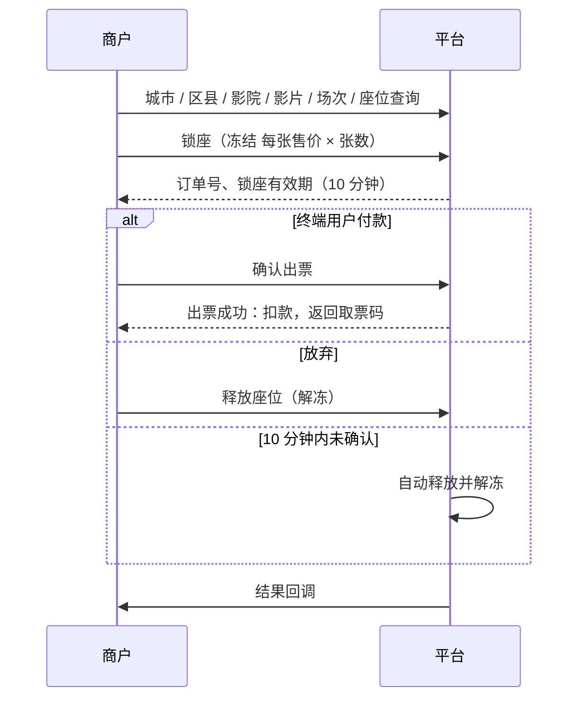
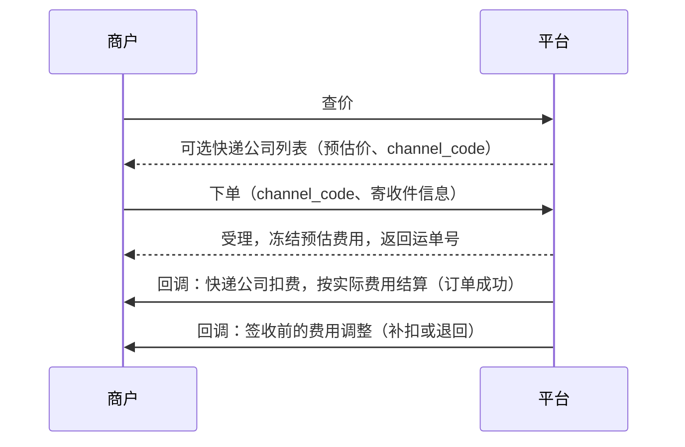
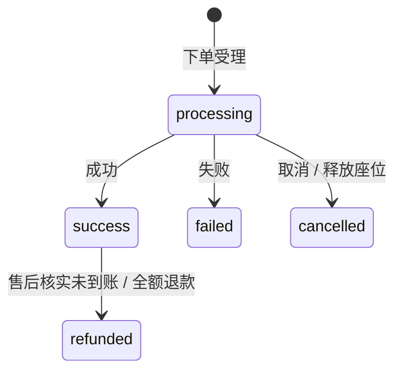

# 开放 API 对接文档

> 适用对象：接入平台开放 API 的商户（下游）技术人员
> 更新日期：2026-10-06

平台通过一套开放 API 提供 **话费、卡券、电影票、快递** 四条业务线的服务。你只需要对接这一套接口，就能使用账户已开通的全部业务。

**目录**

1. [接入流程](#1-接入流程)
2. [通用约定](#2-通用约定)
3. [签名规则](#3-签名规则)
4. [接口总览](#4-接口总览)
5. [通用接口](#5-通用接口)
6. [话费与卡券](#6-话费与卡券)
7. [电影票](#7-电影票)
8. [快递](#8-快递)
9. [结果回调](#9-结果回调)
10. [订单状态](#10-订单状态)
11. [错误码](#11-错误码)
12. [对接注意事项](#12-对接注意事项)

---

## 1. 接入流程

1. 注册商户账号，在商户后台「资质资料」提交资质，等待审核通过。
2. 在「服务开通」申请要使用的业务线（话费 / 卡券 / 电影票 / 快递），审核通过后才能查商品和下单。
3. 联系平台充值：预付费模式，线下打款，财务审核后加到可用余额。
4. 在「开发设置」生成 AppKey / AppSecret。需要限制调用来源时，配置 IP 白名单（不配置则不限制）。
5. 按[签名规则](#3-签名规则)给每个请求签名后调用接口。下单时传入你的回调地址。
6. 接收[结果回调](#9-结果回调)并验签，也可以调[订单查询](#52-订单查询)接口主动查询结果。

> 暂不提供沙箱环境，请用小额真实订单联调。

## 2. 通用约定

| 项目 | 说明 |
|---|---|
| 接口地址 | `https://{平台域名}/open-api`，正式域名由平台提供。下文的接口路径都相对于这个地址，例如查询余额为 `https://{平台域名}/open-api/balance` |
| 协议 | HTTPS |
| 请求方式 | GET：参数放在查询字符串里<br>POST：参数用 `application/x-www-form-urlencoded` 表单提交<br>公共参数和业务参数放在一起提交，**不要用 JSON 请求体** |
| 字符编码 | UTF-8 |
| 金额 | 字符串，单位为元，保留两位小数，例如 `"99.20"` |
| 时间 | 字符串，格式 `YYYY-MM-DD HH:mm:ss`，北京时间 |
| 限流 | 按商户限制每秒请求数，超出返回 `40009`。需要调整请联系平台 |

### 2.1 公共参数

每个请求都要带下面这些参数：

| 参数 | 类型 | 必填 | 说明 |
|---|---|---|---|
| `app_key` | string | 是 | 在「开发设置」生成的 AppKey |
| `timestamp` | int | 是 | 当前 Unix 时间戳（秒）。与服务器时间相差超过 5 分钟会被拒绝 |
| `nonce` | string | 是 | 随机字符串，5 分钟内不能重复，建议 16 位以上 |
| `sign` | string | 是 | 签名，见[签名规则](#3-签名规则) |

### 2.2 返回格式

所有接口都返回 JSON，结构固定：

```json
{
  "code": 0,
  "message": "ok",
  "data": {}
}
```

- `code` 为 `0` 表示成功，非 `0` 表示失败，含义见[错误码](#11-错误码)。失败时 `data` 为 `null`，`message` 是错误说明。
- 鉴权类错误返回 HTTP 401 / 403 / 429，接口不存在返回 404，请求方法不对返回 405，系统错误返回 500，其余错误都返回 HTTP 200。**一律以返回体里的 `code` 为准。**
- 返回的 JSON 以后可能增加字段，请忽略不认识的字段，不要因为多了字段就报错。

## 3. 签名规则

### 3.1 计算方法

1. 取除 `sign` 以外的**全部**参数，包括公共参数和业务参数。空值参数也要参与签名。
2. 按参数名的 ASCII 升序排序，拼成 `k1=v1&k2=v2&...`。
   - 参数值用原文，**拼接时不做 URL 编码**。发送请求时照常编码。
3. 以 AppSecret 为密钥，对拼好的字符串做 **HMAC-SHA256**，得到 64 位小写十六进制字符串，即 `sign`。

### 3.2 示例

| 项目 | 值 |
|---|---|
| AppSecret | `demo_secret` |
| 参数 | `app_key=ak_demo`, `timestamp=1758153600`, `nonce=e4b1c2d3f4a5b6c7`, `business_line=recharge` |
| 待签名字符串 | `app_key=ak_demo&business_line=recharge&nonce=e4b1c2d3f4a5b6c7&timestamp=1758153600` |
| sign | `e89290be61170ed37c78476fd421127dd70de8b5ff5f2fd22742efb47ffac990` |

命令行自检：

```bash
printf '%s' 'app_key=ak_demo&business_line=recharge&nonce=e4b1c2d3f4a5b6c7&timestamp=1758153600' | openssl dgst -sha256 -hmac demo_secret
```

### 3.3 示例代码

商户后台「接口文档 → 签名示例下载」提供 PHP、Java、Python、Node.js 四种语言的示例代码，都只依赖标准库。每个示例都包含请求签名、回调验签和一次查询余额调用，直接运行时最后一行会输出自检签名，应与上表一致。

PHP 参考实现：

```php
function sign(array $params, string $secret): string
{
    unset($params['sign']);
    ksort($params);
    $pairs = [];
    foreach ($params as $k => $v) {
        $pairs[] = $k . '=' . $v;
    }
    return hash_hmac('sha256', implode('&', $pairs), $secret);
}
```

### 3.4 常见签名错误

- 拼接前对参数值做了 URL 编码。
- 漏掉了空值参数，或漏掉了业务参数，只签了公共参数。
- 签名里的参数和实际发送的参数不一致，例如 HTTP 客户端自动加了参数，或去掉了空值参数。
- 用 JSON 请求体提交。平台只按表单或查询字符串解析参数。

## 4. 接口总览

| 分类 | 方法 | 路径 | 说明 |
|---|---|---|---|
| 通用 | GET | `/balance` | 查询余额 |
| 通用 | GET | `/order` | 订单查询（所有业务线） |
| 话费 / 卡券 | GET | `/products` | 商品列表 |
| 话费 | POST | `/orders/recharge` | 话费下单 |
| 卡券 | POST | `/orders/card` | 卡券下单 |
| 电影票 | GET | `/movie/cities` | 城市列表 |
| 电影票 | GET | `/movie/regions` | 区县列表 |
| 电影票 | GET | `/movie/cinemas` | 影院列表 |
| 电影票 | GET | `/movie/films` | 影片列表 |
| 电影票 | GET | `/movie/shows` | 场次列表 |
| 电影票 | GET | `/movie/seats` | 座位图 |
| 电影票 | POST | `/movie/lock` | 锁座 |
| 电影票 | POST | `/movie/confirm` | 确认出票 |
| 电影票 | POST | `/movie/release` | 释放座位 |
| 快递 | POST | `/express/quote` | 查价 |
| 快递 | POST | `/express/order` | 下单 |
| 快递 | POST | `/express/cancel` | 取消 |
| 快递 | GET | `/express/trace` | 轨迹查询 |

下文各接口的「请求参数」都不含公共参数，调用时要另外加上。

## 5. 通用接口

### 5.1 查询余额

`GET /balance`

查询账户的可用余额、冻结金额和待到账返佣。只需公共参数。

**返回 data**

| 字段 | 类型 | 说明 |
|---|---|---|
| `available_balance` | string | 可用余额（元）。有欠款时为负数 |
| `frozen_balance` | string | 冻结金额（元），即处理中订单占用的钱 |
| `pending_rebate` | string | 待到账返佣（元），不属于余额 |
| `debt_since` | string\|null | 开始欠款的时间，没有欠款时为 `null`。欠款期间暂停下单 |

```json
{
  "code": 0,
  "message": "ok",
  "data": {
    "available_balance": "1000.00",
    "frozen_balance": "99.20",
    "pending_rebate": "3.50",
    "debt_since": null
  }
}
```

### 5.2 订单查询

`GET /order`

按平台订单号或你的订单号查询订单，适用于全部业务线。

**请求参数**

| 参数 | 类型 | 必填 | 说明 |
|---|---|---|---|
| `order_no` | string | 二选一 | 平台订单号 |
| `merchant_order_no` | string | 二选一 | 你的订单号 |

**返回 data**：[订单对象](#53-订单对象)，另外按业务线追加：

| 字段 | 类型 | 说明 |
|---|---|---|
| `card_no` | string | 卡号（明文）。只有卡密类卡券订单成功后才返回 |
| `card_pwd` | string | 卡密（明文）。同上 |
| `movie` | object | 电影票订单明细，见[电影票订单明细](#76-电影票订单明细) |
| `express` | object | 快递订单明细，见[快递订单明细](#85-快递订单明细) |

```json
{
  "code": 0,
  "message": "ok",
  "data": {
    "order_no": "C20260918100000123456",
    "merchant_order_no": "M202609180001",
    "business_line": "card",
    "status": "success",
    "sale_price": "97.00",
    "frozen_amount": "97.00",
    "deducted_amount": "97.00",
    "refunded_amount": "0.00",
    "completed_at": "2026-09-18 10:00:05",
    "fail_code": null,
    "fail_reason": null,
    "card_no": "8800123456789",
    "card_pwd": "ABCD-EFGH-IJKL"
  }
}
```

查不到订单时返回 `42005`。只能查到自己账户下的订单。

### 5.3 订单对象

下单、锁座、确认出票、释放座位、快递取消、订单查询接口都返回这个结构。

| 字段 | 类型 | 说明 |
|---|---|---|
| `order_no` | string | 平台订单号。首字母表示业务线：`R` 话费、`C` 卡券、`M` 电影票、`E` 快递 |
| `merchant_order_no` | string | 你的订单号 |
| `business_line` | string | 业务线：`recharge` 话费、`card` 卡券、`movie` 电影票、`express` 快递 |
| `status` | string | 订单状态，见[订单状态](#10-订单状态) |
| `sale_price` | string | 售价（元） |
| `frozen_amount` | string | 下单时冻结的金额（元） |
| `deducted_amount` | string\|null | 实际扣款（元），订单成功后才有值 |
| `refunded_amount` | string | 已退款金额（元） |
| `completed_at` | string\|null | 完成时间 |
| `fail_code` | int\|null | 失败原因码（430xx），见[错误码](#11-错误码) |
| `fail_reason` | string\|null | 失败原因 |

## 6. 话费与卡券

### 6.1 商品列表

`GET /products`

返回你已开通业务线的在售商品、售价，以及按你当前等级计算的每单返佣。

**请求参数**

| 参数 | 类型 | 必填 | 说明 |
|---|---|---|---|
| `business_line` | string | 是 | `recharge` 话费、`card` 卡券。传其它值返回 `41002` |

**返回 data**（数组，每项如下）

| 字段 | 类型 | 说明 |
|---|---|---|
| `id` | int | 商品 ID，下单时作为 `product_id` |
| `name` | string | 商品名称 |
| `operator` | string\|null | 话费：运营商，`mobile` 移动、`unicom` 联通、`telecom` 电信。卡券为 `null` |
| `province` | string\|null | 话费：限定省份，`null` 表示全国。卡券为 `null` |
| `charge_speed` | string\|null | 话费：到账速度，`fast` 快充、`slow` 慢充。卡券为 `null` |
| `card_type` | string\|null | 卡券：`direct` 直充（下单必传 `recharge_account`）、`card_secret` 卡密（下单不能传）。话费为 `null` |
| `face_value` | string | 面值（元） |
| `sale_price` | string | 售价（元），下单时按此冻结 |
| `rebate` | string | 每单返佣（元），订单完成后按平台规定期限到账 |

```json
{
  "code": 0,
  "message": "ok",
  "data": [
    {
      "id": 12,
      "name": "移动 100 元快充",
      "operator": "mobile",
      "province": null,
      "charge_speed": "fast",
      "card_type": null,
      "face_value": "100.00",
      "sale_price": "99.20",
      "rebate": "0.30"
    },
    {
      "id": 31,
      "name": "游戏点卡 100 元",
      "operator": null,
      "province": null,
      "charge_speed": null,
      "card_type": "card_secret",
      "face_value": "100.00",
      "sale_price": "97.00",
      "rebate": "2.00"
    }
  ]
}
```

- 两条业务线共用这一个接口，用不上的字段返回 `null`。
- **平台不识别手机号所属运营商**：运营商和省份体现在商品上，请按号码自行选择对应商品。号码和商品运营商不符时充值会失败，冻结金额会解冻。
- 没开通对应业务线时返回 `42007`。

### 6.2 话费下单

`POST /orders/recharge`

给手机号充值话费，每单数量固定为 1。

**请求参数**

| 参数 | 类型 | 必填 | 说明 |
|---|---|---|---|
| `merchant_order_no` | string | 是 | 你的订单号，在你的账户下唯一，最长 64 个字符 |
| `product_id` | int | 是 | 商品 ID |
| `recharge_account` | string | 是 | 充值手机号 |
| `callback_url` | string | 是 | 结果回调地址，只支持 http/https 公网地址 |

**返回 data**：[订单对象](#53-订单对象)

```json
{
  "code": 0,
  "message": "ok",
  "data": {
    "order_no": "R20260918100000123456",
    "merchant_order_no": "M202609180001",
    "business_line": "recharge",
    "status": "processing",
    "sale_price": "99.20",
    "frozen_amount": "99.20",
    "deducted_amount": null,
    "refunded_amount": "0.00",
    "completed_at": null,
    "fail_code": null,
    "fail_reason": null
  }
}
```

### 6.3 卡券下单

`POST /orders/card`

购买卡券，每单数量固定为 1。直充类卡券充到指定账号；卡密类卡券成功后通过[订单查询](#52-订单查询)获取卡号卡密。

**请求参数**

| 参数 | 类型 | 必填 | 说明 |
|---|---|---|---|
| `merchant_order_no` | string | 是 | 你的订单号，在你的账户下唯一，最长 64 个字符 |
| `product_id` | int | 是 | 商品 ID |
| `recharge_account` | string | 视情况 | 充值账号。商品 `card_type = direct` 时必传，`card_type = card_secret` 时**不能传**，传错返回 `41001` |
| `callback_url` | string | 是 | 结果回调地址，只支持 http/https 公网地址 |

**返回 data**：[订单对象](#53-订单对象)，`order_no` 以 `C` 开头。

### 6.4 下单说明（话费、卡券通用）

- `code = 0` 表示订单**已受理**，接口不等待充值结果，一般返回 `status = processing`。最终结果以回调或订单查询为准。
- 受理时就能确定失败的（例如可用余额不足）直接返回 `status = failed` 和 `fail_code`，不会扣钱。
- 同一个 `merchant_order_no` 重复提交不会重复下单，会返回第一次的订单。**网络超时时请用原单号重试**，不要换新单号。
- 账户有欠款时返回 `42004`，充值补足欠款后自动恢复下单。
- 话费到账时间从几秒到几小时不等，请以回调为准。

## 7. 电影票

平台只提供接口，**不提供选座页面**，选座页面由你自己实现。下单分**锁座**和**确认出票**两步：终端用户选好座位后先锁座，付款后再确认出票。



### 7.1 城市 / 区县 / 影院

数据每天同步，影院变动会增量更新。

| 接口 | 参数 | 返回 data |
|---|---|---|
| `GET /movie/cities` | 无 | `cities[]`：`city_id`、`city_name`、`first_letter`、`is_hot` |
| `GET /movie/regions` | `city_id`（必填） | `regions[]`：`region_id`、`region_name` |
| `GET /movie/cinemas` | `city_id`（必填）、`region_id`（可选）、`page`（默认 1）、`per_page`（默认 20，最多 100） | `data[]`：`cinema_id`、`cinema_name`、`region_id`、`address`、`tel`、`longitude`、`latitude`；以及 `total`、`page`、`per_page` |

```json
{
  "code": 0,
  "message": "ok",
  "data": {
    "cities": [
      { "city_id": "440300", "city_name": "深圳", "first_letter": "S", "is_hot": true }
    ]
  }
}
```

### 7.2 影片 / 场次 / 座位

这三个接口都是实时查询。

| 接口 | 参数 | 返回 data |
|---|---|---|
| `GET /movie/films` | `city_id`（必填） | `films[]`：`film_id`、`film_name`、`attributes`（海报、时长等展示信息） |
| `GET /movie/shows` | `cinema_id`、`film_id`（都必填，用影院、影片接口返回的 ID） | `shows[]`，见下 |
| `GET /movie/seats` | `show_id`（必填。部分场次 ID 含特殊字符，传参时注意 URL 编码） | `seats[]`，见下 |

**场次 `shows[]`**

| 字段 | 类型 | 说明 |
|---|---|---|
| `show_id` | string | 场次 ID |
| `cinema_id` / `film_id` | string | 影院、影片 |
| `show_time` | string | 开场时间 |
| `price` | string\|null | 不分区场次的每张售价。分区场次为 `null`，价格看 `areas` |
| `areas[]` | array | 分区：`area_id`、`area_name`、`price`（每张售价）。不分区为空数组 |
| `attributes` | object | 展示信息，如 `hall_name` 影厅名 |

**座位 `seats[]`**

| 字段 | 说明 |
|---|---|
| `seat_code` | 座位编码，锁座时传它 |
| `row` / `col` | 座位图上的格子坐标，用于画图。隔着过道会跳号 |
| `row_label` / `col_label` | 显示用的排号、座号 |
| `area_id` | 所属分区 |
| `love_status` | `0` 普通座、`1` 情侣座左、`2` 情侣座右 |
| `available` | 是否可选 |

```json
{
  "code": 0,
  "message": "ok",
  "data": {
    "shows": [
      {
        "show_id": "S20260930193000",
        "cinema_id": "1001",
        "film_id": "F1",
        "show_time": "2026-09-30 19:30:00",
        "price": "40.00",
        "areas": [],
        "attributes": { "hall_name": "1 号厅" }
      }
    ]
  }
}
```

- 返回的价格已经是**你的售价**（每张），锁座时按这个价格冻结。
- 查询失败（包括场次刚下架）返回 `42011`，请约 30 秒后重试。

**选座规则**（锁座时平台会校验，不满足直接拒绝）：

1. 一单 1 ~ 4 个座位。
2. 分区场次不能跨分区选座。
3. 情侣座必须左右成对购买。
4. 同一排被过道隔开的一段如果超过 5 个座位，所选座位左右都不能只剩 1 个空座。

### 7.3 锁座

`POST /movie/lock`

锁定座位，并按最新场次价格冻结 `每张售价 × 张数`。平台不采用你传的任何价格。锁座有效期 10 分钟。

**请求参数**

| 参数 | 类型 | 必填 | 说明 |
|---|---|---|---|
| `merchant_order_no` | string | 是 | 你的订单号，在你的账户下唯一，最长 64 个字符 |
| `callback_url` | string | 是 | 结果回调地址，只支持 http/https 公网地址 |
| `cinema_id` | string | 是 | 影院 ID |
| `film_id` | string | 是 | 影片 ID |
| `show_id` | string | 是 | 场次 ID |
| `seat_codes` | string | 是 | 座位编码，英文逗号分隔，例如 `1-3,1-4` |
| `mobile` | string | 是 | 取票手机号，11 位 |

**返回 data**：[订单对象](#53-订单对象) + [`movie` 明细](#76-电影票订单明细)

```json
{
  "code": 0,
  "message": "ok",
  "data": {
    "order_no": "M20260923100000123456",
    "merchant_order_no": "M202609230001",
    "business_line": "movie",
    "status": "processing",
    "sale_price": "80.00",
    "frozen_amount": "80.00",
    "deducted_amount": null,
    "refunded_amount": "0.00",
    "completed_at": null,
    "fail_code": null,
    "fail_reason": null,
    "movie": {
      "cinema_id": "1001",
      "cinema_name": "万达影城",
      "film_id": "F1",
      "film_name": "长安三万里",
      "show_id": "S20260930193000",
      "show_time": "2026-09-30 19:30:00",
      "area_id": null,
      "seats": [
        { "seat_code": "1-3", "row_label": "1", "col_label": "3", "love_status": 0 },
        { "seat_code": "1-4", "row_label": "1", "col_label": "4", "love_status": 0 }
      ],
      "seat_count": 2,
      "unit_price": "40.00",
      "lock_expire_at": "2026-09-23 10:10:00",
      "confirmed_at": null,
      "ticket_codes": []
    }
  }
}
```

- 选座不合法返回 `41001`（`message` 说明原因）；场次已停售或所选分区不可售返回 `42012`。这两种情况都不会冻结金额。
- 场次价格刚好变动时锁座会失败：`status = failed`、`fail_code = 43004`，全额解冻。请 2~3 分钟后重新查询场次再锁座。
- 同一个 `merchant_order_no` 重复提交不会重复锁座。

### 7.4 确认出票

`POST /movie/confirm`

终端用户付款后调用。只能在锁座有效期内确认，重复调用会返回当前状态。

**请求参数**

| 参数 | 类型 | 必填 | 说明 |
|---|---|---|---|
| `order_no` | string | 二选一 | 平台订单号 |
| `merchant_order_no` | string | 二选一 | 你的订单号 |

**返回 data**：同锁座。

- 多数情况下几秒内出票，接口返回时可能已经是 `success`，取票码在 `movie.ticket_codes`。仍是 `processing` 时，以回调或订单查询为准。
- 锁座已超时返回 `42013`，请重新锁座。
- 出票失败会全额解冻，`status = failed`。
- **出票成功后不支持退票、改签。** 影院修改票根时会再回调一次新的取票码，请以最新一次为准。

### 7.5 释放座位

`POST /movie/release`

放弃已锁的座位。订单变为 `cancelled`，全额解冻。参数同确认出票。

- 已确认出票的订单不能释放，返回 `42010`。
- 锁座 10 分钟内没有确认出票的订单会被自动释放：`status = failed`、`fail_code = 43005`，全额解冻。

### 7.6 电影票订单明细

`movie` 对象字段：

| 字段 | 类型 | 说明 |
|---|---|---|
| `cinema_id` / `cinema_name` | string | 影院 |
| `film_id` / `film_name` | string | 影片 |
| `show_id` / `show_time` | string | 场次和开场时间 |
| `area_id` | string\|null | 分区，不分区为 `null` |
| `seats` | array | 座位：`seat_code`、`row_label`、`col_label`、`love_status` |
| `seat_count` | int | 张数 |
| `unit_price` | string | 每张售价（元），`sale_price = unit_price × seat_count` |
| `lock_expire_at` | string | 锁座到期时间，到期前必须确认出票 |
| `confirmed_at` | string\|null | 确认出票时间 |
| `ticket_codes` | array | 取票码 / 验证码，出票成功后才有 |

## 8. 快递

快递下单时只有**预估费用**。快递公司按实际计费重量扣费时结算，订单变为成功；扣费后到签收前还可能产生附加费用。



### 8.1 查价

`POST /express/quote`

按寄收件地址和重量查询可用的快递公司和预估价格。只查价，不产生订单、不冻结金额。地址属于个人信息，所以这个接口用 POST。

**请求参数**

| 参数 | 类型 | 必填 | 说明 |
|---|---|---|---|
| `sender_province` / `sender_city` / `sender_district` | string | 是 | 寄件省、市、区县 |
| `sender_address` | string | 否 | 寄件详细地址，查价可不传 |
| `receiver_province` / `receiver_city` / `receiver_district` | string | 是 | 收件省、市、区县 |
| `receiver_address` | string | 否 | 收件详细地址，查价可不传 |
| `weight` | int | 是 | 重量，整数公斤，1 ~ 1000 |
| `length` / `width` / `height` | int | 否 | 长宽高（厘米），三个要么都传，要么都不传 |
| `insured_amount` | string | 否 | 保价金额（元）。传了就只返回支持保价的快递公司 |

**返回 data**：`channels[]`，按 `total_price` 从低到高排序，每项如下：

| 字段 | 类型 | 说明 |
|---|---|---|
| `channel_code` | string | 快递渠道编号，下单时传它。同一渠道的编号固定不变，可以保存复用 |
| `company_name` | string | 快递公司名称 |
| `freight` | string | 运费（元） |
| `insured_fee` | string | 保价费（元），不保价为 `0.00` |
| `material_fee` | string | 耗材费（元），揽收后可能变化 |
| `total_price` | string | 预估总价（元）= 运费 + 保价费 + 耗材费 |
| `billing_rule` | string\|null | 计费说明（首重、续重等） |
| `allow_insured` | bool | 是否支持保价 |
| `appointment_times` | array | 可选的预约取件时间段。部分快递公司下单时必传 |

```json
{
  "code": 0,
  "message": "ok",
  "data": {
    "channels": [
      {
        "channel_code": "EX3f9a1c7b20e4d581",
        "company_name": "中通",
        "freight": "10.00",
        "insured_fee": "0.00",
        "material_fee": "0.00",
        "total_price": "10.00",
        "billing_rule": "首重 1kg，续重每 kg",
        "allow_insured": false,
        "appointment_times": []
      }
    ]
  }
}
```

- 返回的是预估价，最终按快递公司扣费时的实际费用结算，多退少补。
- 返回空列表表示这个地址和重量暂时没有可用的快递公司。渠道查询本身失败时返回 `42008`，请稍后重试。

### 8.2 下单

`POST /express/order`

选定查价返回的快递公司下单，快递员上门取件。平台会按最新价格重新计算并冻结预估费用，不采用你传的任何金额。

**请求参数**

| 参数 | 类型 | 必填 | 说明 |
|---|---|---|---|
| `merchant_order_no` | string | 是 | 你的订单号，在你的账户下唯一，最长 64 个字符 |
| `channel_code` | string | 是 | 查价返回的 `channel_code` |
| `callback_url` | string | 是 | 结果回调地址，只支持 http/https 公网地址 |
| `sender_name` | string | 是 | 寄件人姓名 |
| `sender_mobile` | string | 是 | 寄件人手机或座机 |
| `sender_province` / `sender_city` / `sender_district` | string | 是 | 寄件省、市、区县 |
| `sender_address` | string | 是 | 寄件详细地址 |
| `receiver_name` | string | 是 | 收件人姓名 |
| `receiver_mobile` | string | 是 | 收件人手机或座机 |
| `receiver_province` / `receiver_city` / `receiver_district` | string | 是 | 收件省、市、区县 |
| `receiver_address` | string | 是 | 收件详细地址 |
| `item_name` | string | 是 | 物品名称 |
| `weight` | int | 是 | 重量，整数公斤，1 ~ 1000 |
| `length` / `width` / `height` | int | 否 | 长宽高（厘米），要么都传，要么都不传 |
| `insured_amount` | string | 否 | 保价金额（元），所选快递公司必须支持保价 |
| `appointment_time` | string | 否 | 预约取件时间段，必须是查价返回的 `appointment_times` 之一。部分快递公司必传 |

**返回 data**：[订单对象](#53-订单对象) + [`express` 明细](#85-快递订单明细)

```json
{
  "code": 0,
  "message": "ok",
  "data": {
    "order_no": "E20260923100000123456",
    "merchant_order_no": "M202609230002",
    "business_line": "express",
    "status": "processing",
    "sale_price": "14.50",
    "frozen_amount": "14.50",
    "deducted_amount": null,
    "refunded_amount": "0.00",
    "completed_at": null,
    "fail_code": null,
    "fail_reason": null,
    "express": {
      "company_code": "EX8b21d4e05fa7c396",
      "company_name": "顺丰",
      "waybill_no": "SF1234567890",
      "logistics_status": "pending_pickup",
      "insured_amount": null,
      "signed_at": null,
      "fees": null,
      "fee_adjustments": []
    }
  }
}
```

**费用与结算**

| 环节 | 规则 |
|---|---|
| 下单 | 按最新预估价冻结 |
| 快递公司受理 | 按它确认的运费重算预估价，多退少补冻结金额 |
| 快递公司扣费 | 按实际费用结算，订单变为 `success`：比冻结的多，从可用余额补扣；比冻结的少，解冻差额 |
| 扣费后到签收前 | 可能产生耗材费、保价费、逆向费（拒收退回），或重量核实后退回运费。每次都会补扣或退回，并回调你 |

结算示例（假设运费售价 = 运费成本 + 2 元）：

| 场景 | 冻结 | 实际 | 结算 |
|---|---|---|---|
| 实际比预估贵 | 12 元 | 运费售价 15 元 | 冻结的 12 元全部扣款，再从可用余额补扣 3 元 |
| 实际比预估便宜 | 12 元 | 运费售价 10 元 | 扣款 10 元，解冻 2 元 |
| 扣费后新增耗材费 | — | 耗材费 3 元 | 从可用余额补扣 3 元 |

- 补扣可能让可用余额变成负数。有欠款时暂停下单，充值补足后恢复。
- 所选快递公司当前不可用（渠道下线、地址或重量变了、要保价但不支持）时返回 `42009`，请重新查价。
- 同一个 `merchant_order_no` 重复提交不会重复下单。
- 不提供面单打印，快递员上门时会带面单。
- 重量核实、理赔、催件等售后不通过接口办理，请联系平台客服。

### 8.3 取消

`POST /express/cancel`

取消快递订单，全额解冻。只有**待揽收**的订单能取消。

**请求参数**

| 参数 | 类型 | 必填 | 说明 |
|---|---|---|---|
| `order_no` | string | 二选一 | 平台订单号 |
| `merchant_order_no` | string | 二选一 | 你的订单号 |

**返回 data**：同下单，成功取消时 `status = cancelled`。

- 已揽收、已取消，或该快递公司不支持取消时，返回 `42010`。
- 个别情况下取消已提交、但结果稍后才确认，此时返回 `status = processing`，确认后会回调你。

### 8.4 轨迹查询

`GET /express/trace`

参数同取消。

**返回 data**

| 字段 | 类型 | 说明 |
|---|---|---|
| `order_no` | string | 平台订单号 |
| `waybill_no` | string\|null | 运单号 |
| `logistics_status` | string | 物流状态，取值见下 |
| `traces` | array | 轨迹列表：`time` 时间、`description` 描述 |

```json
{
  "code": 0,
  "message": "ok",
  "data": {
    "order_no": "E20260923100000123456",
    "waybill_no": "SF1234567890",
    "logistics_status": "in_transit",
    "traces": [
      { "time": "2026-09-23 15:02:11", "description": "快递员已揽收" },
      { "time": "2026-09-23 21:40:05", "description": "已到达深圳转运中心" }
    ]
  }
}
```

### 8.5 快递订单明细

`express` 对象字段：

| 字段 | 类型 | 说明 |
|---|---|---|
| `company_code` | string | 下单时传的快递渠道编号 |
| `company_name` | string | 快递公司名称 |
| `waybill_no` | string\|null | 运单号。个别快递公司下单后稍晚才有 |
| `logistics_status` | string | 物流状态：`pending_pickup` 待揽收、`in_transit` 运输中、`signed` 已签收、`rejected` 拒收退回、`cancelled` 已取消 |
| `insured_amount` | string\|null | 保价金额 |
| `signed_at` | string\|null | 签收时间 |
| `fees` | object\|null | 实际费用明细：`freight` 运费、`insured_fee` 保价费、`material_fee` 耗材费、`reverse_fee` 逆向费。快递公司扣费（订单成功）前为 `null` |
| `fee_adjustments` | array | 扣费之后的费用调整记录：`type`（`supplement` 补扣 / `refund` 退回）、`item`（`freight` / `insured` / `material` / `reverse`）、`amount`、`created_at` |

物流状态是订单的子状态，不影响订单主状态 `status`。

## 9. 结果回调

### 9.1 触发时机

以下情况，平台会向下单时传入的 `callback_url` 发送通知：

- 订单成功、失败、已取消
- 订单已退款（售后核实未到账等）
- 快递：扣费结算，以及之后的每次费用调整
- 电影票：影院修改票根，取票码变化

### 9.2 请求格式

- 方法：`POST`
- Content-Type：`application/x-www-form-urlencoded`
- 超时：连接 3 秒，整体 5 秒

**回调参数**

| 参数 | 类型 | 必带 | 说明 |
|---|---|---|---|
| `order_no` | string | 是 | 平台订单号 |
| `merchant_order_no` | string | 是 | 你的订单号 |
| `business_line` | string | 是 | 业务线 |
| `status` | string | 是 | `success` 成功、`failed` 失败、`cancelled` 已取消、`refunded` 已退款 |
| `completed_at` | string | 否 | 完成时间 |
| `refunded_amount` | string | 否 | 已退款金额（元），退过款才带。部分退款时 `status` 仍为 `success`，用它判断退了多少 |
| `fail_code` | int | 否 | 失败原因码，只在失败时带 |
| `fail_reason` | string | 否 | 失败原因，只在失败时带 |
| `waybill_no` | string | 否 | 快递：运单号 |
| `logistics_status` | string | 否 | 快递：物流状态 |
| `deducted_amount` | string | 否 | 快递：目前实际扣款合计（元），扣费后才有 |
| `freight` / `insured_fee` / `material_fee` / `reverse_fee` | string | 否 | 快递：实际运费、保价费、耗材费、逆向费（元），扣费后才有 |
| `ticket_codes` | string | 否 | 电影票：取票码列表的 **JSON 字符串**，出票成功后才有 |
| `app_key` | string | 是 | 你的 AppKey |
| `timestamp` | int | 是 | 发送时的时间戳（秒） |
| `nonce` | string | 是 | 随机字符串 |
| `sign` | string | 是 | 签名 |

没有值的字段不会出现在回调里，也不参与签名。

> 回调里**不带卡号卡密**。卡密类卡券成功后，请调[订单查询](#52-订单查询)获取。

### 9.3 验签

规则和请求签名相同：取收到的全部参数（`sign` 除外），按参数名升序拼接，用你的 AppSecret 做 HMAC-SHA256，与 `sign` 比较。建议同时校验 `timestamp` 在 5 分钟以内。

**请对收到的全部参数验签，不要只取你认识的字段。** 平台以后可能在回调里增加字段，只取已知字段会导致验签失败。

### 9.4 应答与重试

- 处理完成后，响应内容返回纯文本 `success`（不区分大小写）。
- 其它响应内容、非 2xx 状态码或超时，都视为失败。平台会按 **1 分钟、5 分钟、15 分钟、1 小时、2 小时、6 小时** 的间隔重试 6 次（共 7 次）。之后可以在商户后台「订单列表」手动重推。
- 回调地址必须是公网 http/https 地址，指向内网或保留地址的不会发送。

### 9.5 幂等处理

同一订单可能收到多次通知，例如重试、手动重推、成功后又退款、快递费用调整、电影票改票根。请按订单状态做幂等处理：

- 快递以**最新一次**的 `deducted_amount` 为准。
- 电影票以**最新一次**的 `ticket_codes` 为准。

## 10. 订单状态

| status | 含义 | 资金 |
|---|---|---|
| `processing` | 处理中 | 已冻结 |
| `success` | 成功 | 已扣款 |
| `failed` | 失败 | 已解冻 |
| `cancelled` | 已取消（快递取消、电影票释放座位） | 已解冻 |
| `refunded` | 已退款 | 已退回可用余额 |



各业务线何时算成功：

| 业务线 | 成功时机 | 成功之后 |
|---|---|---|
| 话费、卡券 | 充值到账 / 发卡 | 售后核实未到账时可能变为 `refunded` |
| 电影票 | 出票成功 | 终态，不支持退票 |
| 快递 | 快递公司按实际计费重量扣费 | 物流状态和费用调整单独记录，不改变 `status` |

- 订单长时间拿不到结果时，会转平台人工处理，期间状态保持 `processing`。
- `failed`、`cancelled`、`refunded` 都是终态。

## 11. 错误码

| 分段 | 含义 |
|---|---|
| 400xx | 鉴权与安全 |
| 410xx | 请求参数 |
| 420xx | 业务校验 |
| 430xx | 订单失败原因：**不作为接口的 `code` 返回**，而是放在订单的 `fail_code` 里 |
| 490xx | 通用 |
| 500xx | 系统错误 |

| code | 说明 | HTTP 状态码 | 处理建议 |
|---|---|---|---|
| 40001 | 缺少或错误的公共参数 app_key/timestamp/nonce | 401 | 检查公共参数 |
| 40002 | app_key 不存在 | 401 | 核对 AppKey |
| 40003 | 商户状态不可用 | 403 | 联系平台 |
| 40004 | 商户尚未生成密钥 | 403 | 在「开发设置」生成密钥 |
| 40005 | 签名错误 | 401 | 见[常见签名错误](#34-常见签名错误) |
| 40006 | timestamp 与服务器时间相差超过 5 分钟 | 401 | 校准服务器时间 |
| 40007 | nonce 重复 | 401 | 每次请求生成新的 nonce |
| 40008 | 来源 IP 不在白名单内 | 403 | 检查 IP 白名单配置 |
| 40009 | 请求过于频繁，请稍后再试 | 429 | 降低频率；需要提额请联系平台 |
| 41001 | 请求参数缺失或格式错误 | 200 | 看 `message` 中的具体说明 |
| 41002 | 不支持的业务线 | 200 | 检查 `business_line` |
| 42001 | 商品不存在 | 200 | 重新拉取商品列表 |
| 42002 | 商品未上架 | 200 | 重新拉取商品列表 |
| 42003 | 商品不属于该业务线 | 200 | 话费商品不能用卡券接口下单，反之亦然 |
| 42004 | 商户当前存在欠款，已暂停下单 | 200 | 充值补足欠款后自动恢复 |
| 42005 | 订单不存在 | 200 | 核对订单号 |
| 42006 | 商品暂不可售 | 200 | 稍后重试或换商品 |
| 42007 | 未开通该业务线 | 200 | 在商户后台「服务开通」申请 |
| 42008 | 快递渠道暂时不可用 | 200 | 稍后重试 |
| 42009 | 所选快递公司当前不可用 | 200 | 重新查价后下单 |
| 42010 | 订单当前状态不能取消 | 200 | — |
| 42011 | 电影票服务暂时不可用 | 200 | 约 30 秒后重试 |
| 42012 | 场次不存在或已停售 | 200 | 重新查询场次 |
| 42013 | 锁座已超时 | 200 | 重新选座锁座 |
| 43001 | 可用余额不足 | — | 订单失败原因。充值后用新单号重新下单 |
| 43002 | 商品暂时无法供货 | — | 订单失败原因 |
| 43003 | 订单处理失败 | — | 订单失败原因 |
| 43004 | 场次价格已变动 | — | 订单失败原因。2~3 分钟后重新查询场次再锁座 |
| 43005 | 锁座超时未确认出票，座位已释放 | — | 订单失败原因 |
| 49001 | 接口不存在 | 404 | 检查请求路径 |
| 49002 | 请求方法不正确 | 405 | 检查 GET / POST |
| 49003 | 请求无法处理 | 200 | — |
| 50000 | 系统繁忙，请稍后再试 | 500 | 稍后重试。下单接口请用**原单号**重试 |

最新的错误码列表以商户后台「接口文档 → 错误码」为准。

## 12. 对接注意事项

1. **下单超时，用原单号重试。** 同一个 `merchant_order_no` 只会产生一笔订单，重复提交返回第一次的结果。换新单号重试可能导致重复下单、重复扣钱。
2. **`code = 0` 不等于订单成功。** 下单接口的 `code = 0` 只表示受理，订单结果看 `status`。
3. **失败订单的单号不能再用。** 订单失败后要重新下单时，请使用新的 `merchant_order_no`，否则只会返回那笔失败的订单。
4. **以回调为主，查询兜底。** 长时间没收到回调时，再调订单查询确认结果；不要高频轮询。
5. **余额与冻结。** 下单时冻结，成功扣款，失败或取消解冻。快递补扣、售后扣回返佣可能让余额变成负数，欠款期间所有下单接口返回 `42004`。
6. **返佣。** 返佣不实时到账，按「订单完成时间 + 平台规定期限」自动进入可用余额，到账前计入 `pending_rebate`。
7. **卡密安全。** 订单查询返回的是明文卡号卡密，请勿写入日志或明文存储。
8. **时间同步。** 请保持服务器时间准确，误差超过 5 分钟的请求会被拒绝。
9. **兼容新增字段。** 返回体和回调都可能增加字段，请忽略不认识的字段；回调验签要包含所有收到的参数。
