# 接口开放平台 需求文档

> 版本：v1.7（2026-09-14）
> 状态：业务规则已全部确定，并已按卡速售（话费、卡券）、云洋（快递）、芒果（电影票）接口文档核对调整，对接细节见[卡速售对接说明](suppliers/kasushou.md)、[云洋对接说明](suppliers/yunyang.md)、[芒果对接说明](suppliers/mango.md)。电影票供应商文档核对已全部关闭，无剩余事项；剩余事项见[第 11 节](#11-待确认问题)，所有决定汇总见[附录 决策记录](#附录-决策记录)。

| 版本 | 日期 | 说明 |
|---|---|---|
| v0.1 – v0.8 | 2026-09-11 | 需求讨论：逐步确定供应商、余额冻结、价格、商户等级与返佣、快递与电影票规则 |
| v0.9 | 2026-09-11 | 整理：调整章节顺序，新增术语表，合并重复内容 |
| v1.0 | 2026-09-11 | 确认剩余 19 项业务规则；新增售后章节 |
| v1.1 | 2026-09-11 | 确认争议时限、返佣期限、签名算法、回调地址；电影票改为两步接口；新增错误码映射规则和供应商文档核对清单 |
| v1.2 | 2026-09-11 | 按卡速售、云洋接口文档调整：话费按运营商建商品、不识别手机号；新增安全价格、成功后被退款的处理；快递查价返回快递公司列表、只对运费加价、以供应商扣费为结算点、暂不返佣、售后由客服代提交；供应商回调只作为触发 |
| v1.3 | 2026-09-11 | 确认不对供应商回调做来源 IP 白名单，靠随机令牌 + 查询接口兜底；卡速售状态 -1（未支付）确认为预存款不足，按明确失败 + 告警财务处理；快递返佣确认延后到业务测试阶段再定 |
| v1.4 | 2026-09-14 | 电影票供应商确定为芒果，接入模式确定为纯 API 转发（不采用其 H5 嵌入方案）；按芒果接口文档调整 7.3 节：场次成本取值、分区/情侣座/隔空选座/单笔限座等锁座校验规则、锁座固定 10 分钟有效期、回调无签名、返佣取值字段、城市/影院/场次同步方式；确认本期不支持芒果的"快速通道"加急出票和"自动换座"；确认场次记录自带的影院/影片 ID 仅供参考、不能用于后续请求；发现芒果文档未覆盖"出票成功后退票"场景，列入待确认问题 |
| v1.5 | 2026-09-14 | **确认电影票出票成功后不支持退票**（业务方明确此为最终规则，非临时兜底）：移除 7.3、7.4、7.7、4.4、5.4 中"电影票退票"相关的售后/作废/退款流程，电影票不再有成功后的退款分支；11.2 节电影票供应商文档确认全部关闭，无剩余事项 |
| v1.6 | 2026-09-14 | 电影票订单完成时间简化为**出票成功时间**（原为场次开场时间）：既然出票成功后不支持退票，不需要再等到开场才算完成，与话费、卡券的"成功即完成"规则一致，返佣到账更快 |
| v1.7 | 2026-09-14 | **供应商改成单选业务线**（原为可多选）：一条供应商记录只属于一条业务线；同一个实际供应商账号覆盖多条业务线时配置成多条记录，各自维护账号密钥、各自查询余额；6.1、6.3、6.7 节及 2.2 节架构图同步调整 |

**目录**

1. [项目概述](#1-项目概述)
2. [角色与系统组成](#2-角色与系统组成)
3. [业务线](#3-业务线)
4. [商户与资金](#4-商户与资金)
5. [价格与返佣](#5-价格与返佣)
6. [供应商管理](#6-供应商管理)
7. [订单流程](#7-订单流程)
8. [功能清单](#8-功能清单)
9. [非功能需求](#9-非功能需求)
10. [分期计划](#10-分期计划)
11. [待确认问题](#11-待确认问题)
12. [附录 决策记录](#附录-决策记录)

---

## 1. 项目概述

### 1.1 定位

平台做**接口中转**：上游对接各类供应商（话费充值、卡券、电影票、快递），下游给商户提供统一的开放 API。商户不用分别对接各个供应商，调平台一套接口就能使用所有已开通的服务。

平台**只提供接口，不做面向终端用户的页面**（比如电影选座页面由商户自己做）。

### 1.2 盈利模式

所有商户按**同一个售价**下单，平台赚取售价与成本之间的差价，再按商户等级返还一部分佣金。

**订单和返佣分开记录、分开结算，互不关联**：

| 收支 | 计算 | 说明 |
|---|---|---|
| 订单毛利 | 售价 − 成本 | 每笔订单单独核算 |
| 返佣收支 | 供应商返佣 − 商户返佣 | 话费、卡券没有供应商返佣，只有商户返佣支出；电影票、快递两项都可能有 |

平台总利润 = 订单毛利 + 返佣收支，报表中分开统计。

> 例：移动 100 元话费，成本 98.50 元，售价 99.20 元，商品返佣金额 0.50 元，金牌商户等级比例 100%。
> 订单毛利 0.70 元，商户返佣 0.50 元，平台每单合计赚 0.20 元。

### 1.3 资金模式

| 环节 | 规则 | 详见 |
|---|---|---|
| 充值 | 预付费：商户线下打款，财务审核后加余额 | [4.3](#43-充值与调账) |
| 下单 | 先冻结订单金额，订单成功才扣除，失败解冻 | [4.4](#44-账户余额) |
| 返佣 | 不实时到账，按"订单完成时间 + 固定期限"自动进入可用余额 | [5.4](#54-返佣到账) |
| 欠款 | 余额为负时暂停下单，不透支 | [4.5](#45-负余额) |

### 1.4 术语

| 术语 | 含义 |
|---|---|
| 供应商 | 实际提供话费、卡券、电影票、快递服务的第三方平台，平台调用其接口下单 |
| 对接驱动 | 一套供应商系统的接口代码实现；同一套系统的多个供应商共用一个驱动 |
| 业务线 | 话费、卡券、电影票、快递 |
| 本地商品 | 平台自己维护的话费、卡券标准商品，带售价和商品返佣金额；话费按运营商分别建立 |
| 售价 | 商户下单支付的价格，对所有商户统一 |
| 成本 | 平台付给供应商的价格 |
| 安全价格 | 下单时传给供应商的价格上限，供应商当前成本超过它就拒单 |
| 可用余额 | 商户能用来下单的钱 |
| 冻结余额 | 处理中订单占用的钱 |
| 商户等级 | 运营创建并手动分配，决定商户的返佣比例，不影响售价 |
| 返佣基数 | 计算商户返佣的基础金额：话费、卡券为商品返佣金额，电影票、快递为供应商返佣 |
| 等级比例 | 商户等级在某业务线（或话费、卡券的某个商品）上的返佣比例 |
| 商户返佣 | 平台返给商户的佣金 = 返佣基数 × 等级比例 |
| 供应商返佣 | 电影票、快递供应商在订单成功或回调时返回、返给平台的佣金 |
| 待到账返佣 | 已生成、尚未到账的商户返佣，不属于余额 |
| 订单完成时间 | 返佣期限的起算时间，各业务线不同，见 [7.5](#75-订单完成时间) |
| 返佣固定期限 | 在返佣管理后台设置；返佣到账时间 = 订单完成时间 + 固定期限 |
| 欠款预警线 | 商户欠款超过该金额时告警 |
| 异常单 | 超过设定时长仍拿不到供应商结果、转人工处理的订单 |
| 未到账争议 | 订单显示成功，商户反馈实际没到账，需要客服向供应商核实 |

## 2. 角色与系统组成

### 2.1 角色

| 角色 | 使用的系统 | 说明 |
|---|---|---|
| 平台管理员 | 系统管理后台 | 平台内部人员；角色和权限可在后台自定义，预置超级管理员、运营、财务、客服 |
| 商户 | 商户管理后台 + 开放 API | 企业或个人均可入驻；一个商户一个登录账号，**不设子账号** |
| 供应商 | —（平台主动调用对方接口） | 真正提供服务的第三方平台 |

### 2.2 系统组成

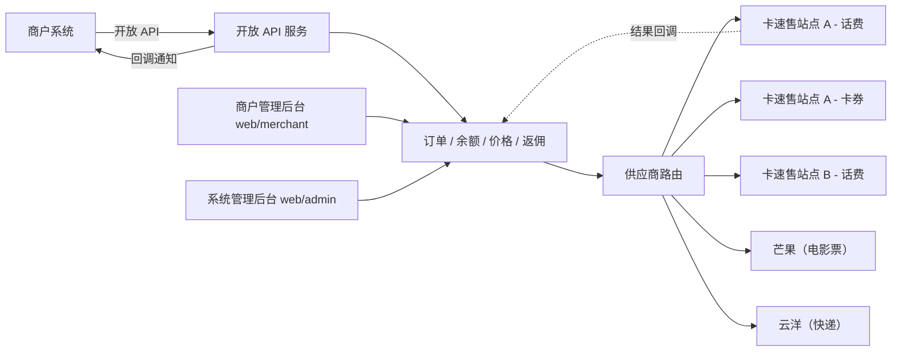

> 图中话费、卡券供应商数量仅为示例；`卡速售站点 A - 话费` 和 `卡速售站点 A - 卡券` 是同一个实际供应商账号配置出的两条供应商记录（供应商单选业务线，见 [6.1](#61-概念)）。

| 模块 | 说明 |
|---|---|
| 开放 API 服务 | 给商户系统调用：签名鉴权、限流、查询、下单、回调商户 |
| 商户管理后台 | 前端 `web/merchant`，商户自助管理 |
| 系统管理后台 | 前端 `web/admin`，平台内部运营管理 |
| 供应商路由与对接 | 为每笔订单挑选供应商、失败时切换；每套供应商系统一个对接驱动，见[第 6 节](#6-供应商管理) |
| 异步任务 | 调用供应商下单、供应商结果查询、商户回调重试、供应商余额监控、供应商商品同步、熔断恢复、城市影院同步、返佣到期入账、异常单标记 |

后端统一在 Hyperf 项目里，按路由前缀区分：`/open/*`（开放 API）、`/merchant/*`（商户后台接口）、`/admin/*`（系统后台接口）、`/notify/*`（接收供应商回调）。部署方式见[第 9 节](#9-非功能需求)。

## 3. 业务线

| 业务线 | 当前供应商 | 售价 | 返佣基数 | 下单参数 | 结果形态 | 订单完成时间 |
|---|---|---|---|---|---|---|
| 话费 | 多家，卡速售系统 | 本地商品售价 | 商品返佣金额 | 商品（按运营商区分）、手机号 | 异步到账，几秒到几小时 | 订单成功时间 |
| 卡券 | 多家，卡速售系统 | 本地商品售价 | 商品返佣金额 | 商品、充值账号（直充）或无（卡密）；一单一张 | 直充：异步到账；卡密：返回卡号卡密 | 订单成功时间 |
| 电影票 | 一家，芒果 | 场次成本 + 加价规则 | 供应商返佣 | 场次、座位 | 出票成功返回取票码 | 出票成功时间 |
| 快递 | 一家，云洋 | 运费成本 + 加价规则；保价费、耗材费、逆向费按成本 | 供应商返佣（云洋暂无，待确认） | 快递公司、寄/收件人信息、物品、重量、保价金额（可选） | 返回运单号，之后揽收、轨迹、签收 | 签收时间 |

- 对接细节：[卡速售对接说明](suppliers/kasushou.md)、[云洋对接说明](suppliers/yunyang.md)、[芒果对接说明](suppliers/mango.md)
- 话费和卡券的供应商**可能是同一家**：这种情况下配置成两条供应商记录（各选一条业务线），账号密钥可以填一样的；供应商记录本身单选业务线，见 [6.1](#61-概念)
- 电影票、快递目前只接一家，没有路由切换，但数据结构按多家设计，以后加供应商不用改结构
- **话费不识别手机号**：运营商（以及省份、快充/慢充）体现在商品上，如"移动 100 元快充"和"联通 100 元快充"是两个商品，商户按号码自行选择商品；号码与商品运营商不符时供应商会充值失败，按失败解冻
- 卡密：数据库加密存储，接口以明文返回给商户（依赖 HTTPS），所有日志中打码，见[第 9 节](#9-非功能需求)

## 4. 商户与资金

### 4.1 商户入驻

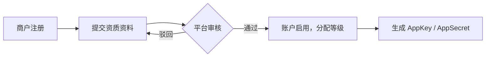

- **企业和个人都可以入驻**：
  - 企业：公司名称、营业执照、法人信息、联系人
  - 个人：姓名、身份证信息、联系方式
- 注册需要手机号/邮箱、密码；一个商户一个登录账号，不设子账号
- 审核通过时给商户分配一个等级（见 [5.2](#52-商户等级)），之后由运营手动调整
- 审核通过后，商户在后台生成接口密钥：
  - `AppKey`：商户身份标识，公开
  - `AppSecret`：签名用的密钥，**只在生成时完整显示一次**，之后只能重置不能再查看；平台验签需要原文，所以不能单向哈希，要**加密存储**
- 商户可配置：IP 白名单；回调地址不在后台配置，每笔订单下单时必须传入（见 [7.6](#76-通知商户)）

### 4.2 开通服务

**按业务线开通**：开通"话费"后，即可购买所有话费商品。

1. 商户在后台查看可开通的业务线
2. 商户提交开通申请
3. 平台运营审核
4. 审核通过后，商户才能调用该业务线的查询和下单接口

### 4.3 充值与调账

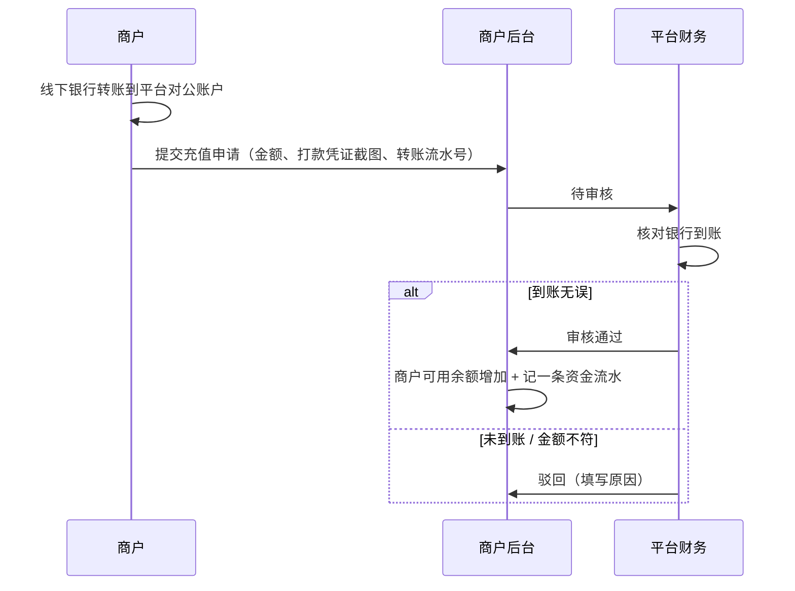

- 只支持线下打款，暂不做线上支付；发票在系统外处理
- **手动调账**：财务可以直接给商户加/扣余额，必须填写原因，**提交即生效，不需要二次审核**，记操作日志；快递理赔款也通过调账加给商户

### 4.4 账户余额

商户账户分**可用余额**和**冻结余额**两部分。**待到账返佣**单独展示，不属于余额。

| 操作 | 可用余额 | 冻结余额 | 发生场景 |
|---|---|---|---|
| 充值 | 增加 | — | 充值审核通过 |
| 冻结 | 减少 | 增加 | 下单 |
| 扣款 | — | 减少 | 订单成功，冻结的钱正式扣掉 |
| 解冻 | 增加 | 减少 | 订单失败 / 取消，冻结的钱退回可用余额 |
| 补扣 | 减少 | — | 快递实际费用高于冻结金额，或扣费后新增费用，从可用余额补扣 |
| 退款 | 增加 | — | 已扣款的订单被退款（售后核实未到账、供应商全额退款、快递费用减少），退回可用余额；电影票出票成功后不支持退票，不适用 |
| 调账 | 增加或减少 | — | 财务手动调账 |
| 返佣入账 | 增加 | — | 商户返佣到期自动入账 |
| 返佣扣回 | 减少 | — | 返佣已到账后，订单经售后核实未到账，从可用余额扣回 |

规则：

- 下单要求**可用余额 ≥ 订单金额**，否则拒绝下单
- 每笔订单的冻结金额最终必须全部处理完：全部扣款、全部解冻，或部分扣款部分解冻（快递按实际费用结算时），**不能重复处理**
- 每次变动都记资金流水，记录变动前后的可用余额和冻结余额

### 4.5 负余额

**并发下单不会导致负数。** 冻结是在数据库事务里先锁住商户账户再检查余额，多笔订单同时到达时排队依次处理，余额不够的那笔直接拒绝。所以下单本身不会把余额扣成负数。

会让可用余额变成负数的只有：

- **快递补扣**：实际运费比冻结的多，或扣费后产生耗材费、逆向费，供应商已经收了平台的钱，必须补扣
- **返佣扣回**：售后核实未到账时，已到账的返佣从可用余额扣回
- **财务手动扣款调账**

处理规则：

- 可用余额 **< 0** 时，**暂停该商户所有下单**，充值补足到 ≥ 0 后自动恢复
- 补扣、返佣扣回照常执行、**不设下限**，必须如实记账
- 后台设置统一的**欠款预警线**：欠款超过该金额时告警财务，商户后台醒目提示尽快充值
- **不给商户透支授信**

## 5. 价格与返佣

### 5.1 售价

**售价对所有商户统一**，商户等级不影响售价，只影响返佣。

| 业务线 | 售价 | 计算单位 |
|---|---|---|
| 话费、卡券 | 运营在本地商品库给每个商品**直接设置** | 每单（一单一个） |
| 电影票 | 场次成本 + 电影票加价规则 | 每张 |
| 快递 | **运费**成本 + 快递加价规则；保价费、耗材费、逆向费**按成本**转给商户（见 [7.2](#72-快递下单与补差价)） | 每单 |

- 电影票、快递的加价规则**按业务线各设置一条，所有商户统一**；加价方式为**固定金额**（成本 + X 元）或**百分比**（成本 × (1 + X%)）
- 按百分比算出的售价**四舍五入到分**
- 订单记录**售价、成本、供应商返佣、商户返佣的快照**，之后调价、改返佣、调等级都不影响历史订单

### 5.2 商户等级

- 运营在后台**创建等级**（如普通、银牌、金牌），名称和数量不限
- 每个商户属于一个等级，**由运营手动调整**
- 创建等级时，为**每个业务线**填写该等级的返佣比例（如金牌：话费 100%、卡券 100%、电影票 80%、快递 80%）
- 话费、卡券的商品可以**单独调整某个等级的比例**，覆盖等级的设置
- 调整商户等级只影响之后下的订单

### 5.3 返佣计算

**商户返佣 = 返佣基数 × 等级比例，向下取整到分**

| 业务线 | 返佣基数 | 来源 |
|---|---|---|
| 话费、卡券 | 商品返佣金额 | 运营设置商品时填写 |
| 电影票、快递 | 供应商返佣 | 供应商在订单成功或回调时返回，由对接驱动解析，无需配置 |

> **快递暂不返佣**：云洋接口文档中没有返佣字段，快递暂按"供应商未返回返佣"处理，等云洋确认后再接入；数据结构保留供应商返佣字段。

**等级比例的取法**（按商户下单时的等级）：

1. 话费、卡券：该商品为这个等级单独设置了比例 → 用商品的比例
2. 否则 → 用该等级在该业务线的比例
3. 都没设置 → 视为 0%，不返佣

一个商品可以只给部分等级单独设置，没设置的等级继续用等级比例。

> **例 1（话费）**：移动 100 元话费，售价 99.20 元，成本 98.50 元，商品返佣金额 0.50 元。
>
> | 等级 | 等级的话费比例 | 该商品单独设置 | 实际比例 | 商户返佣 | 订单毛利 − 商户返佣 |
> |---|---|---|---|---|---|
> | 普通 | 60% | — | 60% | 0.30 元 | 0.40 元 |
> | 银牌 | 75% | — | 75% | 0.375 → **0.37 元**（向下取整） | 0.33 元 |
> | 金牌 | 100% | 90% | 90% | 0.45 元 | 0.25 元 |
>
> **例 2（电影票）**：售价 40 元，成本 38 元，出票成功后供应商返佣 3.00 元，金牌商户电影票比例 80%。
> 商户返佣 3.00 × 80% = 2.40 元；订单毛利 2.00 元，返佣收支 3.00 − 2.40 = 0.60 元，两者分开记录。

规则：

- 话费、卡券的商品没填返佣金额（或为 0），不返佣
- 电影票、快递的供应商没返回返佣（或为 0），不返佣
- 修改商品返佣金额、商品单独设置的比例或等级比例，只影响之后下的订单
- 供应商返佣**不抵扣订单成本**，单独记录、单独与供应商对账

### 5.4 返佣到账

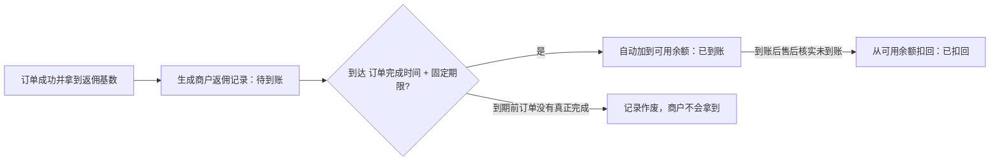

- **到账时间 = 订单完成时间 + 返佣固定期限**；固定期限在返佣管理后台设置，全平台统一，**默认 7 天**
- **生成时机**：订单成功且拿到返佣基数时生成，状态**待到账**，记下当时的等级、返佣基数及来源、比例及来源（商品单独设置 / 等级设置）、金额
- **到账时间**：订单完成时间还没到时（如快递未签收）先空着，到了再算出来
- **入账**：定时任务扫描到期记录，加到商户可用余额，记"返佣入账"资金流水，状态改为**已到账**；每条记录只能入账一次
- **争议暂停**：订单有处理中的未到账争议时，该订单返佣暂停到账，争议处理完再按结果作废或正常到账
- **供应商返佣晚到**：电影票、快递的供应商返佣如果在到账时间之后才返回，收到后由下一次定时任务直接入账
- **作废**：到期前订单没有真正完成（人工改判失败、售后核实未到账、供应商全额退款），待到账记录作废，商户不会拿到这笔返佣；电影票开场前锁座超时/出票失败按失败解冻处理，本身不会生成待到账返佣，出票成功后不支持退票，因此没有"成功后作废"的情况
- **扣回**：返佣期限默认 7 天、与争议时限相同，加上争议期间暂停到账，正常情况下争议都在返佣到账前处理完；只有运营把返佣期限改得比争议时限短，或供应商在返佣到账后才全额退款时，才从可用余额扣回，记"返佣扣回"资金流水，状态改为**已扣回**（见 [7.7](#77-售后)）
- **快递费用调整**：到账前供应商返佣发生变化，按最新金额重算；到账后不再调整、不追回
- **修改固定期限**只影响之后完成的订单

返佣不实时到账、期限从订单完成时间开始算，给异常单处理、快递费用调整留出了时间；只要返佣期限不短于争议时限，绝大多数情况下不会发生"返佣先发出去再扣回"。

### 5.5 价格与返佣保护

- 保存话费、卡券售价时，低于任一启用供应商的成本价要提示
- 保存商品返佣金额或比例时，任一等级的商户返佣会让"订单毛利 − 商户返佣"小于 0，要提示
- 电影票、快递的等级比例超过 100% 时要提示：商户返佣会超过供应商返佣
- 返佣固定期限改得比售后争议时限短时要提示：可能出现返佣到账后再扣回
- 后台**价格预览**：选一个商品，列出售价、各供应商成本、各等级的商户返佣和利润
- **下单时平台不检查供应商成本是否高于售价**，售价与成本的关系由运营负责；支持安全价格的供应商由供应商把关（见 [7.1](#71-话费与卡券下单)）
- 商户看不到成本、供应商信息和供应商返佣
- 售价、加价规则、商品返佣金额、比例、返佣固定期限的每次修改都记操作日志

## 6. 供应商管理

### 6.1 概念

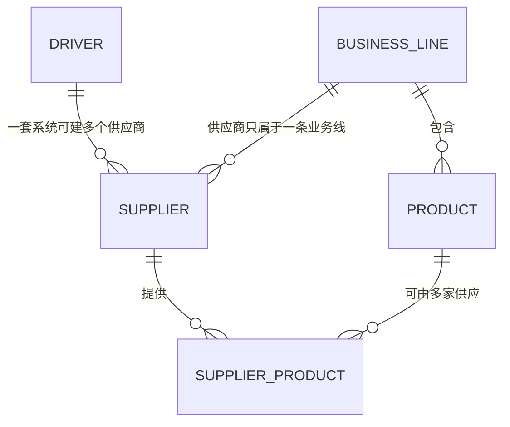

| 概念 | 说明 | 例子 |
|---|---|---|
| 对接驱动（DRIVER） | 一套供应商系统的接口代码实现，**需要开发** | 卡速售 2.0 驱动、云洋驱动 |
| 供应商（SUPPLIER） | 一个具体的供应商账户：选用的驱动 + 接口地址 + 账号密钥 + **所属业务线（单选）**，**后台配置即可** | 卡速售站点 A - 话费、卡速售站点 A - 卡券、卡速售站点 B - 话费 |
| 业务线（BUSINESS_LINE） | 话费、卡券、电影票、快递 | — |
| 本地商品（PRODUCT） | 话费、卡券的标准商品，带售价和商品返佣金额 | 移动 100 元快充，售价 99.20，返佣金额 0.50 |
| 供应商商品（SUPPLIER_PRODUCT） | 本地商品在某个供应商那里对应的商品、成本价、优先级、下单参数映射 | 站点 A 的商品 2909，成本 98.50，优先级 1 |

- 当前驱动：**卡速售 2.0**（话费、卡券）、**云洋**（快递）、**芒果**（电影票）
- 卡速售是 SaaS 系统，不同站点接口相同：接入另一个卡速售站点只需新增供应商配置，不用改代码
- **供应商单选业务线（2026-09-14 确认）**：每条供应商记录只归属一条业务线，不支持一条记录勾选多条；**同一个实际供应商账号（同一套接口地址、账号密钥）如果覆盖多条业务线，就配置成多条供应商记录**，各选一条业务线，例如卡速售同时做话费和卡券，就建"卡速售站点 A - 话费"和"卡速售站点 A - 卡券"两条记录——账号密钥可以填成一样的，但分别维护、分别查询余额（哪怕背后是同一个账户，也会各自查一次，见 [6.7](#67-余额监控)）

### 6.2 对接驱动的统一能力

每个驱动把供应商各自的接口包装成统一能力，业务代码只调用这些能力，不关心具体是哪家：

| 能力 | 适用业务线 | 说明 |
|---|---|---|
| 下单 | 全部 | 返回统一结果（见下）；支持安全价格的供应商传入平台售价 |
| 查询订单 | 全部 | 超时/处理中的订单靠它拿最终结果；收到回调后、资金操作前也用它确认 |
| 解析回调 | 全部 | 验证签名（供应商有签名时），转成统一结果，并按供应商要求的格式回复 |
| 查询余额 | 全部 | 平台在该供应商的预存款 |
| 同步商品 | 话费、卡券 | 供应商有商品接口或变更通知时，同步成本价、状态、库存 |
| 撤单 | 话费、卡券 | 可选；异常单处理时由客服发起 |
| 提交售后、接收售后结果 | 话费、卡券、快递 | 客服核实未到账争议、代提交快递工单时使用 |
| 城市 / 影院 / 影片 / 场次 / 座位查询、锁座、确认出票、释放座位 | 电影票 | 供应商只有一步下单接口时，锁座不调供应商，确认出票时才调用；出票成功后不支持退票，无需解析退票通知 |
| 查询可选快递公司及价格、取消、轨迹查询 | 快递 | — |

**统一结果**：`成功` / `明确失败` / `处理中` / `结果未知`，附带供应商订单号、失败原因、实际成本、退款金额、供应商返佣（电影票、快递）、原始请求和响应。

**驱动最关键的职责**：把供应商的各种错误码正确归类为"明确失败"还是"结果未知"，**拿不准的一律归为结果未知**。错把"未知"当成"失败"会触发换供应商，可能导致重复充值、平台多付成本；错把"失败"当成"未知"只是订单慢一点，转人工处理即可。

#### 错误码映射

每个驱动维护一份**错误码映射表**，把供应商的错误码/订单状态对应到统一结果：

| 统一结果 | 归入条件 | 典型例子 | 平台处理 |
|---|---|---|---|
| 成功 | 供应商明确表示已到账 / 已发卡 / 已出票 / 已扣费 | 卡速售状态 3 交易成功 | 扣款 |
| 明确失败 | 供应商**明确表示订单未受理或已失败、不会扣费** | 参数错误、商品不存在、运营商维护、供应商余额不足、成本超过安全价格 | 话费、卡券换下一家；电影票、快递解冻 |
| 处理中 | 供应商已受理，结果未出 | 卡速售状态 1、2 | 等回调或定时查询 |
| 结果未知 | 其余所有情况 | 网络超时、HTTP 5xx、响应无法解析、**映射表里没有的错误码**、说明含糊的错误码 | 保持处理中、定时查询，超过异常单时长转人工 |

- **映射表写在驱动代码里**，改动走代码评审，不开放后台配置：归类错误会直接造成重复充值或资金损失
- **供应商只返回笼统的失败码时**（如卡速售只有 400），先用平台单号查询供应商订单：**确认没有建单**才算明确失败
- **供应商没有防重复单号时**（如云洋），下单超时**不重试**，按结果未知处理
- 遇到映射表里没有的新错误码，按**结果未知**处理并告警，技术核实后补进映射表
- 签名错误、账号被禁用、供应商余额不足等**供应商侧问题**虽然算明确失败，还要额外告警，并计入熔断统计
- 返回给商户的失败原因使用平台统一错误码和文案，**不透传供应商原始信息**
- 各供应商的具体映射见对接说明：[卡速售](suppliers/kasushou.md)、[云洋](suppliers/yunyang.md)、[芒果](suppliers/mango.md)

### 6.3 供应商信息

| 字段 | 说明 |
|---|---|
| 名称、编码 | 编码用于回调地址等，创建后不能改 |
| 对接驱动 | 从已开发的驱动中选择 |
| 接口配置 | 接口地址、账号、密钥等，不同驱动需要的字段不同；密钥**加密存储**，后台不明文显示 |
| 所属业务线 | 单选：话费 / 卡券 / 电影票 / 快递；一条供应商记录只属于一条业务线，一个实际供应商账号覆盖多条业务线时配置成多条记录，见 [6.1](#61-概念) |
| 回调地址 | 平台自动生成，形如 `/notify/{供应商编码}`，带随机令牌；卡速售下单时逐单传入，云洋在供应商后台配置 |
| 状态 | 启用 / 停用；停用后不再分配新订单，处理中的订单继续查询到结束 |
| 余额预警阈值 | 平台在该供应商的预存款低于此值时告警 |
| 联系人、结算方式、备注 | 线下对接信息 |

### 6.4 商品映射与成本价

- **只有话费、卡券需要映射**：运营把本地商品关联到各供应商的商品，每条映射有**成本价**、**优先级**、启用状态和**下单参数映射**（平台参数对应供应商下单字段，如手机号对应卡速售的 `recharge_account`）
- **本地商品按运营商分别建立**（以及省份、快充/慢充），映射到范围一致的供应商商品
- **成本价同步**：供应商提供商品接口或变更通知的（卡速售支持），自动同步成本价、商品状态和库存，并每天全量校准一次；其他供应商人工录入。成本价每次变化都记历史
- 供应商商品暂停、禁售或库存为 0 时，路由跳过
- 供应商商品的销售限制（可售/禁售渠道、销售限价）只在平台后台记录，**不展示给商户**
- 本地商品没有任何启用的供应商映射时，不能上架
- 电影票、快递没有本地商品，成本和供应商返佣每次从供应商实时获取

### 6.5 路由与失败切换

采用**固定优先级**：运营给每个商品配置的供应商排好顺序，每笔订单按顺序尝试。

> 例：移动 100 元快充配置了 A（优先级 1）、B（优先级 2）、C（优先级 3）。
> 每笔订单都先走 A；A 明确失败换 B；B 也失败换 C；C 也失败，订单失败、解冻。

每笔订单：

1. **筛选**：从该商品配置的供应商里，去掉已停用、被熔断、余额不足、供应商商品不可售（暂停、禁售、库存为 0）的
2. **排序**：按优先级
3. **依次尝试**：每家最多一次；**明确失败**（包括受理后异步回调失败、成本超过安全价格被拒）才换下一家；超时或结果未知时停在当前供应商等结果，**绝不切换**
4. **切换时长限制**：从下单起超过**切换时长**（后台可配，默认 30 分钟）后，当前供应商明确失败就不再换下一家，订单失败、解冻
5. 所有供应商都明确失败 → 订单失败、解冻

- 切换时长只影响"明确失败后还换不换下一家"，不影响正在等结果的订单
- 没有可用供应商（全部停用/熔断/余额不足/不可售）时，下单接口直接返回失败，**不冻结商户余额**
- 以后可增加"成本优先""按比例分流"等排序方式，本次不做

### 6.6 熔断

- **按失败率判断**：默认近 10 分钟内某供应商订单数 ≥ 20 且失败率 > 50%，自动暂停分配新订单 5 分钟并告警；三个值后台可配
- 设订单数下限，避免订单少时一两单失败就误暂停
- 暂停期满自动恢复；运营也可以手动暂停/恢复
- 熔断可以精确到"供应商 + 商品"，避免一个商品出问题影响该供应商的其他商品

### 6.7 余额监控

- 平台在每条供应商记录有预存款，定时通过驱动查询余额，路由时跳过余额不足的供应商
- **供应商单选业务线后，余额按供应商记录各自查询、各自展示**：同一个实际供应商账号如果配置成多条记录（如话费、卡券各一条），即使背后是同一份预存款，也会分别查询、分别统计、分别触发预警，不做合并；这是"供应商单选业务线"设计带来的已知取舍，接受重复查询和可能的重复告警
- 低于预警阈值告警
- 平台给供应商的打款**不在系统中登记**，余额以驱动查询结果为准
- 供应商返回"预存款不足"类错误（如卡速售状态 -1）时，除告警外**立即触发一次该供应商的余额刷新**，避免路由继续把新订单分给它

### 6.8 回调、日志与统计

- 供应商回调统一进入 `/notify/{供应商编码}`（地址带随机令牌），由对应驱动验签、解析；同一结果重复回调要幂等
- **回调只作为触发**：云洋回调没有签名，卡速售回调中的卡密不参与签名，所以收到回调后，**扣款、解冻、结算、退款等资金操作前，一律调用供应商查询接口确认最新状态**；卡密也以查询结果为准
- **不对供应商回调做来源 IP 白名单**（已确认）：回调地址带随机令牌，真实性靠上面的查询接口确认兜底，不依赖来源 IP
- 每次调用供应商（下单、查询、查余额）和每次收到回调，都记录请求、响应、耗时（卡密打码），订单详情里可查看
- 供应商统计：订单量、成功率、平均到账时长、成本总额、供应商返佣总额，按天/商品查看，用于调整优先级

### 6.9 新增供应商流程

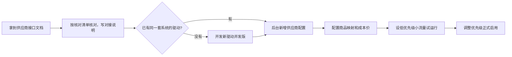

## 7. 订单流程

### 7.1 话费与卡券下单

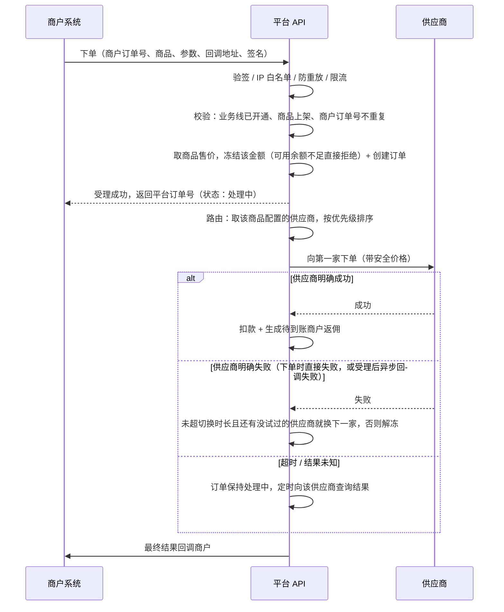

- **幂等**：同一商户的商户订单号唯一，重复提交直接返回已有订单，不重复冻结
- **一单一个**：话费、卡券每单购买数量固定为 1
- **超时不等于失败**：调供应商超时，对方可能已经充值成功。超时订单保持"处理中"，靠查询接口或供应商回调拿到最终结果
- **只在明确失败时换供应商**：超时的订单绝不能换，否则可能两家都充值成功，平台付两份成本
- **安全价格**：供应商支持时（卡速售），下单传入平台售价作为安全价格；供应商当前成本高于售价时会拒单，按明确失败换下一家
- **成功后被退款**：供应商在订单成功后又改为退款（售后、运营商冲正等）时——
  - **全额退款**：自动按"售后核实未到账"处理（订单改为已退款、扣款退回商户、返佣作废或扣回），回调商户并告警
  - **部分退款**：转人工处理
- 切换规则见 [6.5](#65-路由与失败切换)；每次调用供应商都记一条尝试记录，一笔订单可能有多条
- **异常单**：订单处理中超过**异常单时长**（全部业务线统一，后台可配，默认 24 小时）仍拿不到结果，标记为异常单转人工；供应商支持撤单时，客服可发起撤单

### 7.2 快递下单与补差价

特点：**下单时只有预估费用；供应商按实际计费重量扣费时结算；扣费后到签收前还可能产生附加费用。**

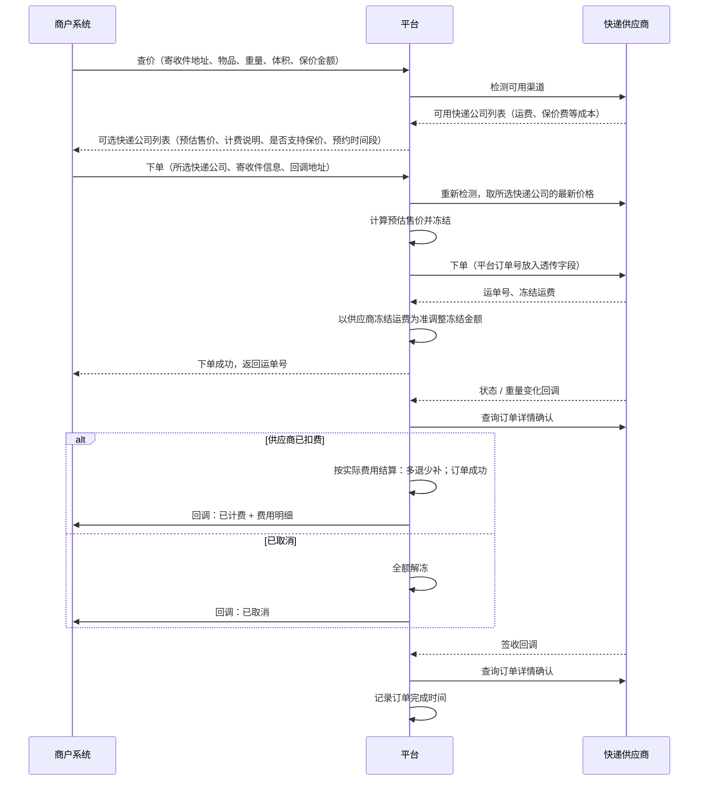

**费用构成**

| 费用 | 何时产生 | 商户支付 |
|---|---|---|
| 运费 | 下单时预估，供应商扣费时按计费重量确定 | 成本 + 快递加价规则 |
| 保价费 | 商户选择保价时 | 按成本 |
| 耗材费（包装、超长超重等） | 揽收后，签收前都可能产生 | 按成本 |
| 逆向费 | 拒收退回、换单时 | 按成本 |

**结算举例**（加价规则假设为"运费成本 + 2 元"）：

| 场景 | 预估 | 冻结 | 实际 | 结算 |
|---|---|---|---|---|
| 实际比预估贵 | 运费成本 10 元，售价 12 元 | 12 元 | 运费成本 13 元，售价 15 元 | 冻结的 12 元全部扣款，再从可用余额**补扣 3 元** |
| 实际比预估便宜 | 运费成本 10 元，售价 12 元 | 12 元 | 运费成本 8 元，售价 10 元 | 冻结的 12 元里扣款 10 元，**解冻 2 元** |
| 扣费后新增耗材费 | — | — | 耗材费成本 3 元 | 按成本从可用余额**补扣 3 元** |

规则：

- **可选快递公司**：供应商返回的快递公司**全部开放**给商户；平台对外使用自己的渠道编号，不暴露供应商渠道 ID
- **下单金额以平台侧为准**：下单前重新向供应商检测价格，不采用商户传入的金额；冻结金额 = 预估售价，不上浮
- **冻结调整**：下单成功后以供应商返回的冻结运费重算预估售价，多退少补冻结金额；可用余额不足时差额留到结算时补扣
- **保价**：商户下单可传保价金额，仅支持保价的快递公司可用
- **结算点**：供应商完成扣费（云洋 `feeOver=1`）时按实际费用结算，订单**成功**；之后到签收前产生的耗材费、保价费、逆向费变化，按费用调整补扣或退回，每次调整记录并回调商户
- **下单超时**：云洋没有防重复单号，超时**不重试**，订单按结果未知处理；平台订单号放在透传字段，之后回调带回时自动关联；超过异常单时长转人工
- **取消**：只能在待揽收时取消，部分快递公司不支持接口取消；供应商主动取消，查询确认后全额解冻
- **拒收退回**：逆向费按成本补扣
- **售后不对商户开放**：重量核实、理赔、催件等，商户联系平台客服，由客服在系统管理后台代提交供应商工单；重量核实退回的运费自动按费用调整退给商户；理赔款由客服核实实际赔付后调账加到商户余额
- **负余额**：补扣可能让可用余额变成负数，按 [4.5](#45-负余额) 处理
- **返佣**：云洋暂无供应商返佣，快递暂不返佣，待云洋确认；订单完成时间为**签收时间**，供应商不推送签收或长时间未签收（退回件、丢件）时，扣费后超过兜底天数（后台可配，默认 15 天）自动完成
- **面单打印不提供**：上门取件由快递员带面单，商户只需要运单号和轨迹

### 7.3 电影票下单

> 电影票供应商为**芒果**，已按其接口文档核对调整，接口形式与本节设计一致（芒果本身就是锁座+确认出票两步接口）；对接细节见[芒果对接说明](suppliers/mango.md)。

平台**只做转发，不做选座页面**：商户自己做页面，调平台接口查询和下单。平台只管**价格**和**钱**，但有两点不能原样转发：

1. **查询结果里的价格要替换**：供应商返回的场次价格是平台成本，必须加价后再返回，否则商户会看到平台底价
2. **下单金额以平台侧为准**：平台按场次成本计算售价，不采用商户传入的价格

终端用户选好座位后通常还要先付款，所以给商户的接口分**锁座**和**确认出票**两步：锁座时冻结金额、占住座位，终端用户付款后商户再确认出票；商户放弃或锁座超时则释放座位、解冻。

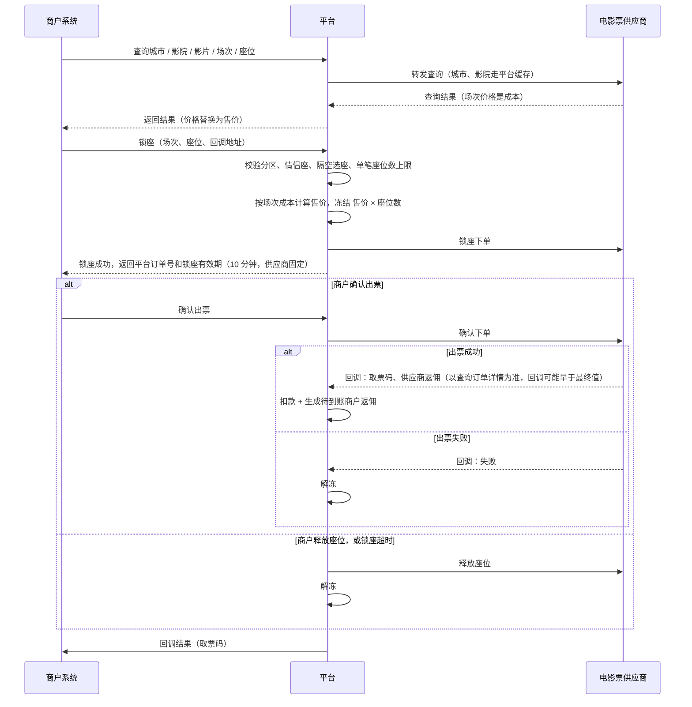

规则：

- **查询数据**：城市、影院用批量拉取接口全量缓存，配合供应商的"影院更新回调"做增量同步（回调只发一次不补发，靠后台手动同步兜底遗漏）；场次有批量拉取权限时预拉取缓存，无权限时实时查询；座位状态变化快，**始终实时查询**，不缓存
- **场次成本取值**：不分区取场次的结算价字段；分区时取对应分区的用户付款价字段，两者字段含义、命名由驱动内部转换，不透传供应商原始字段名
- **锁座前置校验**：座位存在分区时必须带上分区 ID，遗漏会导致订单溢价并被退款；情侣座必须成对且相邻购买；隔空选座（一排连续有效座位 > 5 个时，所选座位两侧不能只留 1 个空位）；单笔订单最多 4 个座位；不满足任一条直接拒绝，不调用供应商
- **订单溢价**：锁座时若供应商返回价格与查询到的成本不一致，按明确失败处理，提示商户延迟后重新查询场次、重新锁座，不解冻（本身未冻结成功）
- **锁座有效期**：以供应商返回/规定的为准，本次对接的供应商固定 10 分钟；供应商为一步式下单接口时，平台锁座只校验和冻结、不调供应商，确认出票时才调用供应商下单（锁座期间座位可能被别人买走，出票失败则解冻），此时锁座有效期由平台设置（后台可配，默认 10 分钟）
- **不支持快速通道**：部分场次除普通价格外还有"快速通道"更高价格，本期只走普通通道下单，不把快速通道作为选项开放给商户，避免确认出票时的实际成本和锁座时的冻结金额对不上
- **不支持自动换座**：座位在锁座和确认出票之间被别人抢先买走时，直接判定失败、解冻，不开放"自动换到其他座位"的选项，保证商户拿到的座位和锁座时选的一致
- **场次记录里的影院/影片 ID 仅供参考**：供应商场次数据里附带的影院 ID、影片 ID 可能和查询时传入的不一致，驱动只按查询时用的 ID 做缓存关联，不用场次记录自带的 ID 发起后续请求
- **出票成功后不支持退票（已确认）**：平台不提供退票、改签接口，出票成功即为终态、不可逆；与供应商接口文档现状一致（文档中也没有出票成功后的退票通知或接口）
- **返佣**：以查询订单详情接口返回的供应商返佣字段为准（回调中的返佣字段可能早于最终值，仅作参考）；订单完成时间为**出票成功时间**（出票成功即不可逆、不会再退票，无需像原方案那样等到场次开场）
- **供应商回调不可信**：出票结果回调不带签名，回调只作为触发，扣款/解冻/生成返佣等资金操作前必须调用查询订单详情接口确认最新状态；出票成功后供应商可能因修改票根再次回调，需幂等处理，不能重复扣款或重复生成返佣
- **场次下架**：查询场次时遇到"场次不存在"类错误，按结果未知处理，间隔约 30 秒后重试，不立即判定失败

### 7.4 订单状态

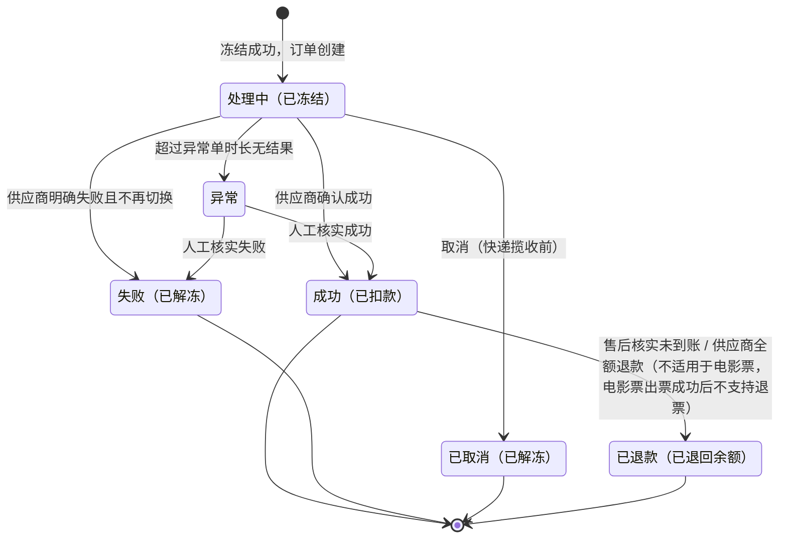

| 业务线 | 何时算"成功" | 成功之后 |
|---|---|---|
| 话费、卡券 | 供应商确认到账 / 发卡 | 售后核实未到账、供应商全额退款 → 已退款；供应商部分退款转人工 |
| 电影票 | 出票成功 | **不支持退票**（已确认），出票成功即为终态、不可逆 |
| 快递 | 供应商按实际计费重量完成扣费 | 运输中、已签收、拒收退回作为物流子状态单独记录；费用调整单独记录，都不改变主状态 |

### 7.5 订单完成时间

订单完成时间是**返佣期限的起算时间**，和订单"成功"不一定是同一时刻：

| 业务线 | 订单完成时间 | 原因 |
|---|---|---|
| 话费、卡券 | 订单成功时间 | 成功即完成 |
| 电影票 | 出票成功时间 | 成功即完成：出票成功后不支持退票，不需要像原方案那样等到场次开场才算完成 |
| 快递 | 签收时间；扣费后超过兜底天数仍未签收则取该时间 | 云洋扣费后到签收前仍可能产生耗材费、保价费 |

### 7.6 通知商户

- **回调地址由商户每笔下单时传入，必填**；订单成功、失败、取消、已退款，以及快递费用调整时，平台 POST 到该地址，内容带签名
- 回调地址只允许 http/https，禁止指向内网和保留地址，防止被利用访问平台内部网络
- 商户返回 `success` 视为通知成功；否则按递增间隔重试 **6 次：1 分钟、5 分钟、15 分钟、1 小时、2 小时、6 小时**，之后商户可在后台手动重推
- 商户也可以随时调订单查询接口主动查结果
- 每次通知的请求和响应都记日志（卡密打码），商户后台可查看

### 7.7 售后

适用于**话费、卡券**。电影票出票成功后不支持退票（见 [7.3](#73-电影票下单)），没有售后环节；快递售后按 [7.2](#72-快递下单与补差价)（由客服代提交，不对商户开放）。

充值成功后一般无法撤回，平台**不接受普通退款申请，只处理"未到账"争议**，商户须在**订单成功后 7 天内**提交（争议时限后台可配）：

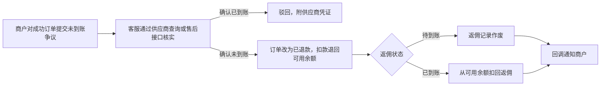

- 争议由商户在商户后台提交，客服在系统管理后台处理，处理结果和凭证商户可查看
- 供应商支持售后接口时（卡速售），客服可直接通过接口提交给供应商并接收处理结果
- 争议处理中，该订单返佣暂停到账（见 [5.4](#54-返佣到账)）
- **供应商主动全额退款**（订单成功后供应商改为已退款）不需要商户提交争议，自动按"确认未到账"处理（见 [7.1](#71-话费与卡券下单)）
- 返佣扣回可能让可用余额变成负数，按 [4.5](#45-负余额) 处理
- 核实未到账但供应商不退钱时，平台已付的成本由运营线下与供应商协商，不在系统内处理

## 8. 功能清单

### 8.1 开放 API

**鉴权与限流**

- 每个请求带公共参数：`app_key`、`timestamp`、`nonce`、`sign`
- 签名：除 `sign` 外的参数按 key 字母排序拼成 `k1=v1&k2=v2`，用 AppSecret 做 **HMAC-SHA256**；平台回调商户时用同样方式签名
- 防重放：`timestamp` 与服务器时间相差超过 5 分钟拒绝；`nonce` 5 分钟内不能重复
- IP 白名单：商户配置了白名单时，非白名单 IP 拒绝
- **按商户限流**：平台设默认值（如每秒 50 次），可对单个商户单独调整
- 统一返回：`{ "code": 0, "message": "ok", "data": {...} }`，`code` 非 0 表示失败，错误码统一编号

**接口**

| 分类 | 接口 | 说明 |
|---|---|---|
| 通用 | 查询余额 | 可用余额、冻结余额、待到账返佣 |
| 通用 | 订单查询 | 按平台订单号或商户订单号查询；卡密类订单返回卡号卡密（明文）；快递订单返回费用明细 |
| 通用 | 结果回调 | 平台 → 商户，见 [7.6](#76-通知商户) |
| 话费、卡券 | 商品列表 | 商户已开通的商品（话费按运营商区分）、售价、该商户等级的每单返佣 |
| 话费、卡券 | 下单 | 两条业务线参数不同，分别设计；数量固定为 1；必传回调地址 |
| 电影票 | 城市 / 影院 / 影片 / 场次 / 座位查询 | 价格替换为售价，见 [7.3](#73-电影票下单) |
| 电影票 | 锁座 / 确认出票 / 释放座位 | 锁座时必传回调地址，见 [7.3](#73-电影票下单) |
| 快递 | 查价 | 返回可选快递公司列表：预估售价、计费说明、是否支持保价、预约时间段 |
| 快递 | 下单 / 取消 / 轨迹查询 | 下单时必传回调地址，可选保价，见 [7.2](#72-快递下单与补差价) |

- 对商户**不暴露供应商信息**：看不到订单走的是哪家供应商，也看不到成本和供应商返佣
- 配套：接口文档、各语言签名示例代码
- **沙箱环境三期提供**，此前商户用小额真实订单联调

### 8.2 商户管理后台（web/merchant）

| 模块 | 功能 |
|---|---|
| 账户 | 注册（企业/个人）、登录、找回密码、修改密码、资质资料提交与审核状态、当前等级 |
| 首页 | 可用余额、冻结余额、待到账返佣、今日订单数/金额、成功率、近 7 天消费趋势；余额为负时醒目提示已暂停下单 |
| 开发设置 | 生成/重置 AppKey 与 AppSecret、IP 白名单 |
| 服务开通 | 可开通的业务线、提交开通申请、查看审核状态 |
| 商品价格 | 已开通商品的售价和按自己等级计算的每单返佣；电影票、快递显示自己等级的返佣比例 |
| 充值 | 提交充值申请（上传打款凭证）、充值记录及审核状态、平台收款账户信息 |
| 资金流水 | 充值、冻结、扣款、解冻、补扣、退款、调账、返佣入账、返佣扣回，支持筛选导出 |
| 返佣 | 返佣明细（订单、金额、状态：待到账 / 已到账 / 已作废 / 已扣回、预计到账时间），支持筛选导出 |
| 订单管理 | 订单列表（按时间/状态/业务线/订单号筛选）、订单详情（快递含费用明细和调整记录）、回调记录与手动重推、导出 |
| 售后 | 对话费、卡券成功 7 天内的订单提交未到账争议，查看核实结果和凭证；快递售后请联系平台客服 |
| 接口文档 | 在线查看 API 文档、下载签名示例 |

### 8.3 系统管理后台（web/admin）

| 模块 | 功能 |
|---|---|
| 商户管理 | 商户列表、入驻审核（企业/个人资质）、启用/禁用、调整等级、限流设置、商户详情（资料、余额、待到账返佣、密钥状态、已开通业务线） |
| 服务开通审核 | 审核业务线开通申请 |
| 充值与调账 | 充值申请审核；手动加扣余额（必填原因，直接生效） |
| 本地商品库 | 话费、卡券商品：业务线、运营商/品牌、面值、类型（直充/卡密）、适用地区、到账速度、售价、商品返佣金额、各等级比例（可选）、上下架 |
| 供应商管理 | 供应商配置、商品映射（成本价、优先级、下单参数映射）、供应商商品同步（成本价、状态、库存、销售限制）、余额监控、熔断状态、调用日志、供应商统计，见[第 6 节](#6-供应商管理) |
| 商户等级 | 创建/编辑等级，为每个业务线填写各等级的返佣比例 |
| 价格设置 | 电影票、快递加价规则（快递只加在运费上）；价格预览 |
| 返佣管理 | 返佣固定期限设置（默认 7 天）；商户返佣明细（待到账 / 已到账 / 已作废 / 已扣回）；供应商返佣明细（电影票、快递） |
| 订单管理 | 全部订单查询；订单详情（供应商尝试记录与请求/响应日志、冻结与扣款记录、快递费用明细与调整记录、返佣记录）；异常单处理（人工置成功/置失败、发起供应商撤单）；部分退款订单处理；手动重新查询供应商；手动重推商户回调 |
| 售后处理 | 话费、卡券未到账争议：查询供应商凭证或提交供应商售后，确认未到账（退款、返佣作废或扣回）或驳回；快递工单代提交（重量核实、理赔、催件）与结果跟踪，理赔款核实后调账 |
| 财务报表 | 资金流水；订单毛利与返佣收支分开统计；按商户/等级/业务线/供应商统计 |
| 对账 | 订单对账（平台订单成本 vs 供应商订单记录）与返佣对账（平台记录的供应商返佣 vs 供应商返佣账单）分开进行，标出差异；卡速售用订单列表接口拉取，云洋逐笔查询订单详情 |
| 告警 | 供应商余额不足、供应商被熔断、商品失败率突增、异常单积压、供应商成功后退款、返佣后亏本、商户欠款超过预警线 |
| 系统设置 | 管理员账号；角色权限（自定义角色、勾选菜单与操作权限，预置超管/运营/财务/客服）；系统参数（切换时长、异常单时长、熔断阈值、默认限流、欠款预警线、售后争议时限、快递完成兜底天数、电影票锁座有效期）；操作日志 |

## 9. 非功能需求

**资金安全（最重要）**

- 金额字段用 `DECIMAL`，禁止用浮点数；按百分比算出的售价四舍五入到分，商户返佣向下取整到分
- 余额变动必须和资金流水写入放在同一个数据库事务里，并**先锁商户账户再检查和修改**
- 每条流水记录变动前后的可用余额和冻结余额，可逐笔核对
- 每笔冻结金额只能处理一次；每条商户返佣只能入账一次、只能扣回一次
- 定时核对：商户冻结余额 = 该商户所有处理中订单的冻结金额之和

**可靠性**

- 下单幂等（商户订单号唯一）
- 供应商超时不判失败、不切换供应商；供应商没有防重复单号时，下单超时不重试
- 供应商回调幂等：同一结果重复回调不能重复处理，也不能重复生成返佣
- 返佣入账任务中断后重跑不会重复入账
- 单个供应商故障通过熔断隔离，不影响其他供应商和业务线

**安全**

- AppSecret、供应商密钥加密存储
- **卡密**：数据库加密存储；接口以明文返回给商户，依赖 HTTPS；供应商调用日志、商户回调日志、接口请求日志中**一律打码**
- **供应商回调不可信**：回调只作为触发，资金相关操作前调用供应商查询接口确认；回调地址带随机令牌，**不做来源 IP 白名单**（已确认），靠查询接口兜底
- 商户传入的回调地址要校验：只允许 http/https，禁止内网和保留地址
- 后台操作全部记操作日志，资金、售价、等级、返佣、供应商配置、系统参数相关操作重点审计

**性能与部署**

- **规模预期**：商户数百家，日订单 1–10 万
- **部署**：单个 Hyperf 服务多实例部署，暂不拆服务、不分表
- **异步处理**：调用供应商下单、结果查询、回调商户、返佣入账、商品同步走异步队列，不阻塞商户下单请求
- 订单表按下单时间、商户、状态建索引，预留历史订单归档方案
- 电影票查询量可能远大于下单：城市、影院走批量拉取 + 更新回调缓存，场次视批量接口权限情况预拉取缓存或实时查询，座位始终实时查询；注意供应商批量接口的调用频率限制（芒果批量拉取影院/场次分别限 300/1200 次每分钟）

## 10. 分期计划

先打通一条业务线的完整闭环，再横向扩展：

| 期次 | 范围 |
|---|---|
| 一期 | 商户入驻与审核（企业/个人）、密钥管理、按业务线开通；充值审核、调账、冻结式余额、资金流水、负余额暂停与欠款预警；商户等级与返佣（商品返佣金额 × 等级比例、到期自动入账、扣回）；本地商品库与售价；供应商管理基础（驱动、供应商配置、商品映射与成本价同步、固定优先级路由与切换时长、余额查询）；**卡速售 2.0 驱动**；**话费业务线**接 2 家供应商，走通下单 → 冻结 → 路由 → 失败切换 → 扣款/解冻 → 返佣 → 回调商户；异常单与售后争议；按商户限流；订单管理；管理员与角色权限 |
| 二期 | 卡券业务线（多家，含卡密）；熔断；财务报表与对账；告警 |
| 三期 | 快递业务线（云洋驱动：查价、补差价、费用调整、客服代提交工单）；电影票业务线（芒果驱动：查询转发、锁座、确认出票、释放座位）；沙箱环境 |

- **话费作为一期**：参数简单、结果明确，同时覆盖了最核心也最容易出资金问题的环节——冻结、扣款、超时处理、供应商切换、解冻、返佣入账与扣回、回调
- **返佣放进一期**：返佣是商户实际价格的一部分，上线时就要有；数据结构一期就同时支持"商品返佣金额"和"供应商返佣"两种基数，避免三期再改表
- **一期接 2 家话费供应商**：只接一家时路由和失败切换无法验证；两家都是卡速售系统时只需开发一个驱动，第二家新增配置即可
- **卡券放二期**：卡券与话费同为卡速售系统，一期驱动可复用，二期主要增加卡密处理

## 11. 待确认问题

业务规则已全部确定。剩下的事项需要向供应商确认，或等电影票供应商文档；在此之前按"当前暂定"设计。

### 11.1 需要向供应商确认

| # | 供应商 | 问题 | 当前暂定 |
|---|---|---|---|
| 1 | — | 快递是否有返佣、如何返回或结算 | 按无返佣处理，快递暂不给商户返佣；确认时机延后到业务测试阶段，不影响一期设计 |
| 2 | 卡速售 | 余额限价 `need_balance` 的含义；接口频率限制 | 不影响一期设计 |
| 3 | 芒果 | 完整错误码表；余额不足时下单返回的错误码；是否要求/提供 IP 白名单；锁座下单重复调用/超时后的行为；批量拉取影院/场次数据的商务权限申请流程和时限 | 详见[芒果对接说明](suppliers/mango.md)第 5 节；不影响一期设计，映射表外错误码按结果未知处理 |

### 11.2 电影票供应商文档确认（已全部关闭）

电影票供应商（芒果）接口文档已到，逐项核对完成，均已确认，无剩余事项。

> 已关闭：快递订单完成时间确定为签收（云洋推送已签收，且扣费后签收前仍可能产生费用）；错误码归类按各供应商对接说明执行；供应商回调不做来源 IP 白名单，靠随机令牌 + 查询接口兜底；卡速售状态 -1 确认为预存款不足，按明确失败处理；电影票供应商确定为芒果，接入模式确定为纯 API 转发（不采用其 H5 嵌入方案）；电影票锁座和出票的接口形式确认为两步（芒果本身就是锁座下单 + 确认下单两步接口，无需驱动适配）；**电影票出票成功后不支持退票**（已确认，与芒果接口文档现状一致）。

### 11.3 供应商文档核对清单

拿到每家供应商的接口文档后逐项确认，结果写成对接说明（`docs/suppliers/`），作为开发该驱动的依据。卡速售、云洋、芒果已核对完成。

**通用（每家都要看）**

| 项目 | 要确认的内容 |
|---|---|
| 接入方式 | 接口地址、测试环境、签名算法、是否要求 IP 白名单、调用频率限制 |
| 下单 | 同步返回最终结果还是只返回受理；是否有防重复单号；重复提交同一订单号时的行为 |
| 结果获取 | 是否有异步回调、回调是否签名、重试机制、需要回复的格式；查询订单接口 |
| 错误码 | 完整错误码表；**哪些错误码明确表示未受理、不扣费**；超时后建议的处理方式 |
| 余额 | 余额查询接口；余额不足时的错误码 |
| 对账 | 是否提供对账文件、对账接口或订单列表接口 |

**话费、卡券**

| 项目 | 要确认的内容 |
|---|---|
| 商品 | 商品编码规则；是否有商品列表、价格和变更通知接口（决定成本价能否自动同步）；下单参数模板 |
| 覆盖范围 | 支持的运营商、省份；快充/慢充的区分和到账时效 |
| 卡密 | 卡号卡密的返回方式、是否加密、是否参与签名 |
| 售后 | 能否查询到账凭证；是否支持撤单、售后申请；成功后是否可能被退款 |

**电影票**（芒果已核对完成，结论见[芒果对接说明](suppliers/mango.md)）

| 项目 | 要确认的内容 | 核对结论 |
|---|---|---|
| 查询 | 城市、影院、影片、场次、座位接口；城市影院数据的更新频率 | 城市/影院批量拉取 + 更新回调增量；影片/场次/座位实时查询，场次可选批量预拉取 |
| 价格 | 场次价格字段的含义（结算价、市场价、服务费） | 结算价字段（或分区用户付款价字段）为平台成本 |
| 锁座出票 | 锁座和出票是否分开；锁座有效期；释放座位接口 | 供应商本身两步式，锁座固定 10 分钟，有释放座位接口 |
| 返佣 | 供应商返佣在哪个接口、什么时机返回，字段含义 | 查询订单详情接口的返佣字段为准，回调中的返佣字段仅供参考 |
| 退票 | 退票通知是否带退款金额和手续费；是否支持部分座位退票；退票后供应商返佣如何处理 | **已确认：出票成功后不支持退票**，与文档现状一致（文档未覆盖该场景），不需要退票相关接口 |

**快递**

| 项目 | 要确认的内容 |
|---|---|
| 查价 | 是否返回多个快递公司；报价是否有报价单号和有效期 |
| 计费 | 何时按实际重量扣费；费用由哪些部分组成；扣费后是否还会变化 |
| 签收 | 是否推送签收；轨迹查询接口 |
| 取消 | 取消接口和可取消时机；供应商主动取消的通知 |
| 售后 | 重量核实、理赔等工单接口；退回运费、理赔款如何返回 |
| 返佣 | 是否有返佣字段 |

---

## 附录 决策记录

以下事项均于 2026-09-11 确认（另有标注日期的除外），正文已按此编写。

| 主题 | 决定 |
|---|---|
| 供应商 | 话费、卡券对接多家，可能是同一家供应商同时提供；电影票、快递暂时各接一家 |
| 供应商（2026-09-14 更新） | **供应商记录改成单选业务线**：一条供应商记录只属于一条业务线，不再支持一条记录勾选多条；同一个实际供应商账号覆盖多条业务线时，配置成多条供应商记录（账号密钥可以填一样的），各自独立维护、独立查询余额；同一条业务线也可以配置多条供应商记录（如多个卡速售站点） |
| 供应商 | 话费、卡券供应商为卡速售 2.0 系统，卡速售只做话费和卡券，不做电影票；快递供应商为云洋 |
| 供应商 | 需要供应商管理；每套供应商系统开发一个驱动 |
| 供应商 | 成本价以人工录入为主，供应商有商品接口的再同步（卡速售支持同步） |
| 供应商 | 平台给供应商的打款不在系统中登记 |
| 供应商 | 供应商商品的销售限制（可售/禁售渠道、销售限价）不展示给商户 |
| 供应商 | 不对供应商回调做来源 IP 白名单，回调地址靠随机令牌 + 收到后查询接口确认真实状态兜底 |
| 供应商 | 卡速售状态 -1（未支付）确认为平台预存款余额不足，按明确失败处理：换下一家供应商 + 告警财务，并触发余额即时刷新 |
| 供应商 | 云洋回调失败由供应商侧自动重试，具体次数间隔待实际对接时观察 |
| 路由 | 固定优先级；话费、卡券明确失败（含受理后异步回调失败）时换下一家，最多试完该商品配置的所有供应商 |
| 路由 | 切换时长后台可配，默认 30 分钟，超过后不再切换 |
| 路由 | 熔断按失败率判断，阈值后台可配 |
| 路由 | 下单时平台不检查供应商成本是否高于售价，由运营负责 |
| 路由 | 支持安全价格的供应商（卡速售）下单时传入平台售价 |
| 商户 | 企业和个人都可以入驻 |
| 商户 | 按业务线开通服务 |
| 商户 | 不设子账号 |
| 资金 | 下单先冻结，成功再扣除，失败解冻 |
| 资金 | 余额为负时暂停该商户下单；固定范围作为欠款预警线；不透支 |
| 资金 | 手动调账不需要二次审核，直接生效 |
| 资金 | 暂不做线上支付和发票 |
| 价格 | 话费、卡券建本地商品库，运营直接设置售价 |
| 价格 | 话费商品按运营商分别建立，商户自行选择，平台不识别手机号 |
| 价格 | 电影票、快递按业务线统一设置加价规则，所有商户相同 |
| 价格 | 快递加价只加在运费上，保价费、耗材费、逆向费按成本转给商户 |
| 价格 | 百分比加价算出的售价四舍五入到分 |
| 等级 | 商户等级在后台创建，由运营手动调整；等级为每个业务线设置返佣比例 |
| 返佣 | 话费、卡券：商品设置固定返佣金额，按商户等级比例返；商品可以单独调整某个等级的比例 |
| 返佣 | 电影票、快递：以供应商在订单成功或回调时返回的返佣金额为基数，按等级比例返 |
| 返佣 | 云洋文档无返佣字段：快递暂按无返佣开发，待云洋确认 |
| 返佣 | 订单是订单、返佣是返佣，互不关联；供应商返佣不抵扣订单成本 |
| 返佣 | 返佣不实时到账；返佣管理后台设置固定期限（默认 7 天），按订单完成时间 + 固定期限到账 |
| 返佣 | 商户返佣向下取整到分 |
| 订单 | 话费、卡券一单一个 |
| 订单 | 异常单时长所有业务线统一，后台可配 |
| 订单 | 回调商户失败按递增间隔重试 6 次：1 分钟、5 分钟、15 分钟、1 小时、2 小时、6 小时 |
| 订单 | 话费、卡券成功后供应商全额退款时自动按售后核实未到账处理，部分退款转人工 |
| 售后 | 话费、卡券只处理未到账争议，须在订单成功后 7 天内提交；核实未到账则退款，返佣未到账作废、已到账从余额扣回 |
| 快递 | 下单时按供应商预估价，供应商按实际重量扣费时补差价 |
| 快递 | 冻结金额不上浮；平台不主动取消未揽收订单；返佣到账后不追回 |
| 快递 | 订单完成时间为签收时间 |
| 快递 | 供应商返回的快递公司全部开放给商户 |
| 快递 | 开放保价，保价费按成本 |
| 快递 | 售后（重量核实、理赔、催件）不对商户开放，由客服代提交；理赔款客服核实后调账给商户 |
| 快递 | 不提供面单打印 |
| 电影票 | 在线选座，平台只做接口转发，不做页面，只管价格和订单 |
| 电影票 | 城市、影院数据由平台缓存 |
| ~~电影票：供应商退票时钱暂定全额退回商户；订单没有完成，不产生返佣~~ | 已被 2026-09-14 决定取代：出票成功后不支持退票，不存在这个分支 |
| 电影票（2026-09-14 更新） | 订单完成时间为出票成功时间（原定场次开场时间，出票后不支持退票被确认后简化为成功即完成） |
| 电影票（2026-09-14） | 供应商确定为芒果；接入模式确定为纯 API 转发，不采用芒果的 H5 嵌入方案 |
| 电影票（2026-09-14） | 锁座和确认出票为两步，芒果本身就是两步接口，无需驱动适配 |
| 电影票（2026-09-14） | 场次成本取芒果的结算价字段（分区时取分区用户付款价字段）；返佣取查询订单详情接口的返佣字段 |
| 电影票（2026-09-14） | 分区必传区域 ID、情侣座成对相邻、隔空选座、单笔最多 4 座，均在平台侧锁座前校验 |
| 电影票（2026-09-14） | 芒果支持的"快速通道"（不同价格的加急出票）和"自动换座"（座位被抢占时自动换座）本期均不支持，固定走普通通道、不自动换座 |
| 电影票（2026-09-14） | **出票成功后不支持退票**，出票成功即为终态、不可逆；与芒果接口文档现状一致（文档未提供该场景的接口或通知） |
| 卡密 | 接口以明文返回（依赖 HTTPS）；数据库加密存储，日志打码 |
| 权限 | 后台角色可自定义，预置超管、运营、财务、客服 |
| 接口 | 按商户限流，每个商户可单独设置 |
| 接口 | 签名算法使用 HMAC-SHA256；回调地址由商户每笔下单时传入，必填 |
| 接口 | 提供沙箱环境，放三期 |
| 规模 | 商户数百家，日订单 1–10 万 |
| 分期 | 认可分期安排：一期话费，二期卡券，三期快递与电影票 |
